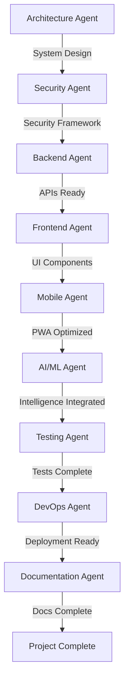

# WhatsOpí Multi-Agent Development Orchestration

## Overview

This document defines the agent orchestration strategy for developing the WhatsOpí platform. Each agent has specific expertise and responsibilities, with clear handover protocols to ensure seamless collaboration.

## Agent Roles & Responsibilities

### 1. **Architecture Agent** (System Designer)
**Expertise**: System design, scalability, infrastructure planning
**Responsibilities**:
- Design overall system architecture
- Define microservices boundaries
- Plan data flow and integration points
- Create infrastructure requirements
- Define API contracts

### 2. **Security Agent** (Security Specialist)
**Expertise**: Security best practices, compliance, threat modeling
**Responsibilities**:
- Implement authentication/authorization
- Design data encryption strategies
- Ensure Dominican Law 172-13 compliance
- Create security audit trails
- Implement API security

### 3. **Frontend Agent** (UI/UX Developer)
**Expertise**: React, TypeScript, PWA, accessibility
**Responsibilities**:
- Build responsive UI components
- Implement offline-first features
- Create voice interface integration
- Ensure cultural UI/UX appropriateness
- Optimize for low-end devices

### 4. **Backend Agent** (API Developer)
**Expertise**: Node.js, databases, microservices
**Responsibilities**:
- Build RESTful APIs
- Implement WhatsApp Business API integration
- Create database schemas
- Build payment processing
- Implement caching strategies

### 5. **AI/ML Agent** (Intelligence Specialist)
**Expertise**: NLP, machine learning, AI integration
**Responsibilities**:
- Integrate Claude API for reasoning
- Implement Dominican Spanish NLP
- Create Haitian Creole language models
- Build credit scoring algorithms
- Implement recommendation systems

### 6. **Mobile Agent** (Mobile Optimization Specialist)
**Expertise**: PWA, mobile performance, offline functionality
**Responsibilities**:
- Optimize for mobile devices
- Implement service workers
- Create offline sync strategies
- Optimize for slow networks
- Handle device capabilities

### 7. **Testing Agent** (Quality Assurance)
**Expertise**: Test automation, performance testing, security testing
**Responsibilities**:
- Create unit tests
- Build integration tests
- Implement E2E tests
- Test offline scenarios
- Validate voice commands

### 8. **DevOps Agent** (Infrastructure & Deployment)
**Expertise**: CI/CD, cloud infrastructure, monitoring
**Responsibilities**:
- Set up CI/CD pipelines
- Configure cloud infrastructure
- Implement monitoring/logging
- Create deployment strategies
- Set up development environments

### 9. **Documentation Agent** (Technical Writer)
**Expertise**: Technical documentation, API documentation, user guides
**Responsibilities**:
- Create comprehensive documentation
- Write API documentation
- Create user guides
- Document deployment procedures
- Maintain knowledge base

## Handover Protocol

### Standard Handover Document Structure

```markdown
# Agent Handover: [From Agent] → [To Agent]
Date: [YYYY-MM-DD]
Sprint: [Sprint Number]

## Work Completed
- List of completed tasks
- Files created/modified
- Decisions made

## Current State
- System status
- Known issues
- Performance metrics

## Next Steps Required
- Priority tasks for next agent
- Dependencies
- Deadlines

## Technical Details
- API endpoints created
- Database changes
- Configuration updates

## Testing Status
- Tests written
- Coverage percentage
- Failed tests requiring attention

## Resources & Documentation
- Relevant documentation links
- External dependencies
- Third-party service credentials

## Critical Information
- Security considerations
- Performance bottlenecks
- Technical debt

## Questions for Next Agent
- Unresolved decisions
- Areas needing clarification
```

## Agent Workflow Sequence



## Communication Protocols

### 1. **Daily Sync Format**
```
Agent: [Name]
Date: [Date]
Status: [Green/Yellow/Red]

Completed Today:
- Task 1
- Task 2

Blockers:
- None / List blockers

Tomorrow's Plan:
- Task 1
- Task 2

Handover Ready: Yes/No
```

### 2. **Issue Escalation**
- **Level 1**: Agent attempts resolution (2 hours)
- **Level 2**: Consult relevant agent expert (4 hours)
- **Level 3**: Architecture Agent intervention (same day)
- **Level 4**: Full team consultation (within 24 hours)

### 3. **Code Review Protocol**
- Each agent reviews previous agent's code
- Focus on their domain expertise
- Document findings in handover
- Suggest improvements without blocking progress

## Sprint Planning

### Sprint 1: Foundation (Week 1-2)
- Architecture Agent: System design
- Security Agent: Security framework
- Backend Agent: Core APIs

### Sprint 2: Frontend Development (Week 3-4)
- Frontend Agent: UI components
- Mobile Agent: PWA optimization
- AI/ML Agent: Basic NLP integration

### Sprint 3: Intelligence & Testing (Week 5-6)
- AI/ML Agent: Advanced features
- Testing Agent: Comprehensive testing
- DevOps Agent: Deployment preparation

### Sprint 4: Production Ready (Week 7-8)
- DevOps Agent: Production deployment
- Documentation Agent: Complete documentation
- All Agents: Final review and optimization

## Success Metrics

### Per-Agent KPIs
1. **Architecture Agent**: System meets scalability requirements
2. **Security Agent**: Zero critical vulnerabilities
3. **Frontend Agent**: Lighthouse score > 90
4. **Backend Agent**: API response time < 200ms
5. **AI/ML Agent**: NLP accuracy > 85%
6. **Mobile Agent**: Offline functionality 100%
7. **Testing Agent**: Code coverage > 80%
8. **DevOps Agent**: Deployment time < 30 minutes
9. **Documentation Agent**: 100% API documentation coverage

## Risk Mitigation

### Agent Unavailability
- Each agent documents work daily
- Backup agent identified for each role
- Critical knowledge in shared repository

### Technical Disputes
- Architecture Agent has final technical decision
- Security Agent has veto on security issues
- Decisions documented with rationale

### Schedule Delays
- Daily progress tracking
- Early escalation of blockers
- Parallel work where possible

## Tools & Resources

### Shared Tools
- GitHub: Code repository
- Notion: Documentation & handovers
- Slack: Communication
- Jira: Task tracking
- Figma: Design collaboration

### Agent-Specific Tools
- Architecture: draw.io, Lucidchart
- Security: OWASP tools, Snyk
- Frontend: Storybook, Chrome DevTools
- Backend: Postman, DataGrip
- AI/ML: Jupyter, TensorBoard
- Mobile: BrowserStack, Lighthouse
- Testing: Jest, Cypress
- DevOps: GitHub Actions, Docker
- Documentation: Swagger, Docusaurus

## Quality Gates

Each handover must meet these criteria:
1. ✓ All assigned tasks completed
2. ✓ Code reviewed and approved
3. ✓ Tests written and passing
4. ✓ Documentation updated
5. ✓ Handover document complete
6. ✓ No critical bugs
7. ✓ Performance benchmarks met
8. ✓ Security scan passed

## Emergency Protocols

### Critical Issue Response
1. Identify affected component
2. Alert relevant agent immediately
3. Create war room if needed
4. Document resolution
5. Post-mortem within 48 hours

### Rollback Procedures
- Each deployment tagged
- Rollback plan documented
- Test rollback monthly
- Recovery time < 15 minutes

This orchestration ensures each agent can work efficiently while maintaining high quality standards and clear communication throughout the WhatsOpí development process.