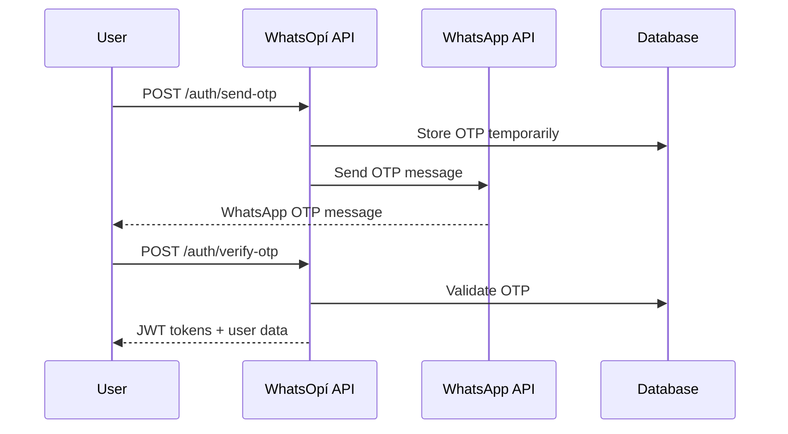

# WhatsOpí API Documentation

*Comprehensive REST API Documentation for Dominican Republic's Informal Economy Platform*

---

## 📋 API Overview

The WhatsOpí API is a comprehensive RESTful service designed specifically for the Dominican Republic's informal economy. It provides secure, scalable, and culturally-aware endpoints for authentication, payments, commerce, and AI-powered services.

### 🔗 Base URLs

| Environment | Base URL | Purpose |
|-------------|----------|---------|
| **Production** | `https://api.whatsopi.do` | Live production environment |
| **Staging** | `https://staging-api.whatsopi.do` | Pre-production testing |
| **Development** | `http://localhost:3001` | Local development |

### 🏗️ API Architecture

- **REST-based**: Following REST principles with JSON payloads
- **OAuth 2.0 + JWT**: Secure authentication with role-based access
- **Rate Limited**: Intelligent rate limiting based on user tier
- **Versioned**: API versioning with backward compatibility
- **Dominican-Optimized**: Specialized for Dominican business practices

---

## 🔐 Authentication

### Overview

WhatsOpí uses a hybrid authentication system optimized for Dominican users:

1. **WhatsApp OTP**: Primary authentication via WhatsApp Business API
2. **SMS Fallback**: SMS OTP for non-WhatsApp users
3. **JWT Tokens**: Secure session management with refresh tokens
4. **Device Fingerprinting**: Enhanced security through device recognition

### Authentication Flow



### 📞 Dominican Phone Number Format

All phone number inputs must follow Dominican Republic formatting:

```json
{
  "valid_formats": [
    "+18091234567",  // International format
    "8091234567",    // National format
    "809-123-4567"   // Formatted display
  ],
  "area_codes": ["809", "829", "849"],
  "validation_regex": "^(\\+1)?(809|829|849)[0-9]{7}$"
}
```

---

## 📚 API Endpoints

### 🔑 Authentication Endpoints

#### Send OTP
Send authentication OTP via WhatsApp or SMS.

```http
POST /api/v1/auth/send-otp
```

**Request Body:**
```json
{
  "phoneNumber": "+18091234567",
  "method": "whatsapp", // "whatsapp" | "sms"
  "language": "es-DO"   // Optional: "es-DO", "ht", "en"
}
```

**Response (200 OK):**
```json
{
  "success": true,
  "data": {
    "otpSent": true,
    "method": "whatsapp",
    "expiresIn": 600,
    "message": "Código enviado via WhatsApp"
  },
  "timestamp": "2024-12-01T10:00:00Z"
}
```

**Rate Limiting:** 3 OTP requests per 15 minutes per phone number

---

#### Register User
Register a new user with Dominican-specific validation.

```http
POST /api/v1/auth/register
```

**Request Body:**
```json
{
  "phoneNumber": "+18091234567",
  "otp": "123456",
  "firstName": "María",
  "lastName": "González",
  "email": "maria@example.com", // Optional
  "cedula": "001-1234567-8",    // Optional Dominican ID
  "role": "customer",           // "customer" | "colmado_owner"
  "preferredLanguage": "es-DO",
  "location": {
    "municipality": "Santo Domingo",
    "sector": "Zona Colonial"
  }
}
```

**Response (201 Created):**
```json
{
  "success": true,
  "data": {
    "user": {
      "id": "usr_abc123",
      "phoneNumber": "+18091234567",
      "firstName": "María",
      "lastName": "González",
      "role": "customer",
      "kycLevel": 0,
      "dailyLimit": 5000.00, // DOP
      "preferredLanguage": "es-DO",
      "createdAt": "2024-12-01T10:00:00Z"
    },
    "tokens": {
      "accessToken": "eyJ0eXAiOiJKV1QiLCJhbGciOiJSUzI1NiJ9...",
      "refreshToken": "rt_xyz789",
      "expiresIn": 3600
    }
  },
  "timestamp": "2024-12-01T10:00:00Z"
}
```

---

#### Login User
Authenticate existing user with OTP.

```http
POST /api/v1/auth/login
```

**Request Body:**
```json
{
  "phoneNumber": "+18091234567",
  "otp": "123456",
  "deviceFingerprint": "fp_device123" // Optional for enhanced security
}
```

**Response (200 OK):**
```json
{
  "success": true,
  "data": {
    "user": {
      "id": "usr_abc123",
      "phoneNumber": "+18091234567",
      "firstName": "María",
      "lastName": "González",
      "role": "customer",
      "kycLevel": 1,
      "dailyLimit": 25000.00,
      "preferredLanguage": "es-DO",
      "lastLoginAt": "2024-12-01T10:00:00Z"
    },
    "tokens": {
      "accessToken": "eyJ0eXAiOiJKV1QiLCJhbGciOiJSUzI1NiJ9...",
      "refreshToken": "rt_xyz789",
      "expiresIn": 3600
    }
  },
  "timestamp": "2024-12-01T10:00:00Z"
}
```

---

### 💰 Payment Endpoints

#### Process Payment
Process payments with Dominican payment methods.

```http
POST /api/v1/payments/process
Authorization: Bearer {access_token}
```

**Request Body:**
```json
{
  "amount": 1500.00,
  "currency": "DOP",
  "paymentMethod": {
    "type": "tpago", // "tpago" | "paypal" | "card" | "cash"
    "details": {
      "tpagoPhone": "+18099876543"
    }
  },
  "recipient": {
    "type": "user", // "user" | "colmado" | "external"
    "id": "usr_def456"
  },
  "description": "Pago por pollo - Colmado La Esquina",
  "metadata": {
    "orderId": "ord_123",
    "colmadoId": "col_456"
  }
}
```

**Response (200 OK):**
```json
{
  "success": true,
  "data": {
    "transactionId": "txn_abc123",
    "status": "completed",
    "amount": 1500.00,
    "currency": "DOP",
    "fees": 15.00,
    "netAmount": 1485.00,
    "exchangeRate": 1.0,
    "paymentMethod": "tpago",
    "processedAt": "2024-12-01T10:05:00Z",
    "confirmationCode": "CONF123456"
  },
  "timestamp": "2024-12-01T10:05:00Z"
}
```

---

### 🛒 Commerce Endpoints

#### Search Products
Search for products in nearby colmados with Dominican Spanish support.

```http
GET /api/v1/products/search
Authorization: Bearer {access_token}
```

**Query Parameters:**
```
q=arroz%20diana          # Search query in Spanish
location[lat]=-69.9312   # Latitude (Santo Domingo)
location[lng]=18.4655    # Longitude
radius=5                 # Search radius in KM
category=alimentos       # Product category
minPrice=50              # Minimum price in DOP
maxPrice=500             # Maximum price in DOP
sortBy=price             # "price" | "distance" | "availability"
page=1                   # Pagination
limit=20                 # Results per page
```

**Response (200 OK):**
```json
{
  "success": true,
  "data": {
    "products": [
      {
        "id": "prod_123",
        "name": "Arroz Diana 5 libras",
        "description": "Arroz blanco de calidad premium",
        "price": 285.00,
        "currency": "DOP",
        "category": "alimentos",
        "images": [
          "https://cdn.whatsopi.do/products/arroz-diana-5lb.jpg"
        ],
        "colmado": {
          "id": "col_456",
          "name": "Colmado La Esquina",
          "location": {
            "address": "Calle Mercedes #123, Zona Colonial",
            "municipality": "Santo Domingo",
            "coordinates": {
              "lat": 18.4655,
              "lng": -69.9312
            }
          },
          "distance": 0.8, // KM from user
          "rating": 4.5,
          "isOpen": true
        },
        "availability": {
          "inStock": true,
          "quantity": 15,
          "lastUpdated": "2024-12-01T09:30:00Z"
        }
      }
    ],
    "meta": {
      "total": 45,
      "page": 1,
      "limit": 20,
      "totalPages": 3
    }
  },
  "timestamp": "2024-12-01T10:00:00Z"
}
```

---

### 🤖 AI Service Endpoints

#### Process Voice Command
Process voice commands in Dominican Spanish or Haitian Creole.

```http
POST /api/v1/ai/voice/process
Authorization: Bearer {access_token}
Content-Type: multipart/form-data
```

**Request Body (Form Data):**
```
audio: [audio file - WAV/MP3/OGG]
language: es-DO         # "es-DO" | "ht" | "en"
context: commerce       # "commerce" | "support" | "general"
```

**Response (200 OK):**
```json
{
  "success": true,
  "data": {
    "transcription": "Klk, busco pollo barato en colmados cercanos",
    "detectedLanguage": "es-DO",
    "confidence": 0.95,
    "intent": {
      "action": "search_product",
      "entities": {
        "product": "pollo",
        "modifier": "barato",
        "location": "cercanos"
      }
    },
    "response": {
      "text": "¡Klk! Te ayudo a buscar pollo barato. Encontré 8 colmados cerca con pollo disponible.",
      "actionRequired": "search_products",
      "searchParams": {
        "query": "pollo",
        "sortBy": "price",
        "radius": 2
      }
    },
    "culturalMarkers": ["klk", "informal_greeting"],
    "processingTime": 1.2 // seconds
  },
  "timestamp": "2024-12-01T10:00:00Z"
}
```

---

#### Chat with AI Assistant
Interact with culturally-aware AI assistant.

```http
POST /api/v1/ai/chat
Authorization: Bearer {access_token}
```

**Request Body:**
```json
{
  "message": "¿Cuánto cuesta enviar dinero a Haití?",
  "language": "es-DO",
  "context": {
    "conversationId": "conv_123",
    "userLocation": {
      "municipality": "Santiago",
      "country": "DO"
    },
    "businessContext": "remittances"
  }
}
```

**Response (200 OK):**
```json
{
  "success": true,
  "data": {
    "response": {
      "text": "Para enviar dinero a Haití, las tarifas varían según el monto:\n\n• $1-100 USD: RD$85 de comisión\n• $101-500 USD: RD$125 de comisión\n• $501+ USD: 2.5% del monto\n\nPuedes enviar a través de nuestros colmados afiliados o directamente desde la app. ¿Te gustaría que te ayude a encontrar un colmado cerca?",
      "language": "es-DO",
      "sentiment": "helpful",
      "culturalContext": "dominican_haitian_relations"
    },
    "suggestions": [
      "Buscar colmados cercanos",
      "Ver tarifas detalladas",
      "Iniciar envío de dinero"
    ],
    "conversationId": "conv_123",
    "processingTime": 0.8
  },
  "timestamp": "2024-12-01T10:00:00Z"
}
```

---

### 📱 WhatsApp Integration Endpoints

#### Send WhatsApp Message
Send messages via WhatsApp Business API.

```http
POST /api/v1/whatsapp/send
Authorization: Bearer {access_token}
```

**Request Body:**
```json
{
  "to": "+18091234567",
  "type": "template", // "template" | "text" | "interactive"
  "template": {
    "name": "order_confirmation",
    "language": "es",
    "components": [
      {
        "type": "body",
        "parameters": [
          {
            "type": "text",
            "text": "María"
          },
          {
            "type": "text", 
            "text": "Arroz Diana 5lb"
          },
          {
            "type": "text",
            "text": "RD$285.00"
          }
        ]
      }
    ]
  }
}
```

**Response (200 OK):**
```json
{
  "success": true,
  "data": {
    "messageId": "wamid.abc123",
    "status": "sent",
    "to": "+18091234567",
    "timestamp": "2024-12-01T10:00:00Z"
  }
}
```

---

## 📊 Data Models

### User Model
```json
{
  "id": "usr_abc123",
  "phoneNumber": "+18091234567",
  "firstName": "María",
  "lastName": "González", 
  "email": "maria@example.com",
  "cedula": "001-1234567-8", // Dominican ID
  "role": "customer", // "customer" | "colmado_owner" | "agent" | "admin"
  "kycLevel": 1, // 0-3, higher = more privileges
  "preferredLanguage": "es-DO",
  "location": {
    "municipality": "Santo Domingo",
    "sector": "Zona Colonial",
    "coordinates": {
      "lat": 18.4655,
      "lng": -69.9312
    }
  },
  "limits": {
    "daily": 25000.00,
    "monthly": 100000.00,
    "transaction": 10000.00
  },
  "reputation": {
    "score": 4.8,
    "totalTransactions": 156,
    "successRate": 0.99
  },
  "createdAt": "2024-12-01T10:00:00Z",
  "updatedAt": "2024-12-01T10:00:00Z"
}
```

### Transaction Model
```json
{
  "id": "txn_abc123",
  "type": "payment", // "payment" | "transfer" | "withdrawal" | "deposit"
  "status": "completed", // "pending" | "processing" | "completed" | "failed" | "cancelled"
  "amount": 1500.00,
  "currency": "DOP",
  "fees": 15.00,
  "netAmount": 1485.00,
  "exchangeRate": 1.0,
  "sender": {
    "id": "usr_abc123",
    "phoneNumber": "+18091234567",
    "name": "María González"
  },
  "recipient": {
    "id": "usr_def456", 
    "phoneNumber": "+18099876543",
    "name": "Colmado La Esquina"
  },
  "paymentMethod": {
    "type": "tpago",
    "lastFourDigits": "4567",
    "provider": "Banco Popular"
  },
  "metadata": {
    "orderId": "ord_123",
    "description": "Pago por pollo",
    "category": "food"
  },
  "location": {
    "municipality": "Santo Domingo",
    "coordinates": {
      "lat": 18.4655,
      "lng": -69.9312
    }
  },
  "createdAt": "2024-12-01T10:00:00Z",
  "completedAt": "2024-12-01T10:05:00Z"
}
```

### Product Model
```json
{
  "id": "prod_abc123",
  "name": "Arroz Diana 5 libras",
  "description": "Arroz blanco de calidad premium",
  "category": "alimentos",
  "subcategory": "granos",
  "price": 285.00,
  "currency": "DOP",
  "unit": "paquete",
  "weight": "5 lb",
  "brand": "Diana",
  "images": [
    "https://cdn.whatsopi.do/products/arroz-diana-5lb.jpg"
  ],
  "barcode": "7421001234567",
  "colmado": {
    "id": "col_456",
    "name": "Colmado La Esquina",
    "ownerId": "usr_789"
  },
  "availability": {
    "inStock": true,
    "quantity": 15,
    "reservedQuantity": 2,
    "lastUpdated": "2024-12-01T09:30:00Z"
  },
  "tags": ["premium", "familia", "popular"],
  "nutritionalInfo": {
    "calories": 130,
    "servingSize": "1/4 taza seca"
  },
  "createdAt": "2024-12-01T08:00:00Z",
  "updatedAt": "2024-12-01T09:30:00Z"
}
```

---

## 📋 Response Format Standards

### Success Response
```json
{
  "success": true,
  "data": {
    // Response data here
  },
  "meta": {
    "page": 1,
    "limit": 20,
    "total": 100,
    "totalPages": 5
  }, // For paginated responses only
  "timestamp": "2024-12-01T10:00:00Z"
}
```

### Error Response
```json
{
  "success": false,
  "error": {
    "code": "VALIDATION_ERROR",
    "message": "El número de teléfono no es válido", // In user's language
    "details": {
      "field": "phoneNumber",
      "reason": "invalid_format",
      "expected": "+1809XXXXXXX or 809XXXXXXX"
    }
  },
  "timestamp": "2024-12-01T10:00:00Z",
  "requestId": "req_abc123"
}
```

---

## 🚨 Error Codes

### Authentication Errors (4000-4099)
| Code | HTTP Status | Message | Description |
|------|-------------|---------|-------------|
| 4001 | 401 | `INVALID_CREDENTIALS` | Invalid phone number or OTP |
| 4002 | 401 | `OTP_EXPIRED` | OTP has expired (>10 minutes) |
| 4003 | 429 | `OTP_RATE_LIMITED` | Too many OTP requests |
| 4004 | 401 | `TOKEN_EXPIRED` | JWT token has expired |
| 4005 | 401 | `INVALID_TOKEN` | JWT token is invalid or malformed |

### Payment Errors (4100-4199)
| Code | HTTP Status | Message | Description |
|------|-------------|---------|-------------|
| 4101 | 400 | `INSUFFICIENT_FUNDS` | User has insufficient balance |
| 4102 | 400 | `LIMIT_EXCEEDED` | Transaction exceeds daily/monthly limits |
| 4103 | 400 | `INVALID_PAYMENT_METHOD` | Payment method not supported |
| 4104 | 422 | `PAYMENT_FAILED` | Payment processing failed |
| 4105 | 400 | `RECIPIENT_NOT_FOUND` | Recipient does not exist |

### Validation Errors (4200-4299)
| Code | HTTP Status | Message | Description |
|------|-------------|---------|-------------|
| 4201 | 400 | `INVALID_PHONE_NUMBER` | Dominican phone number format invalid |
| 4202 | 400 | `INVALID_CEDULA` | Dominican ID (cédula) format invalid |
| 4203 | 400 | `REQUIRED_FIELD_MISSING` | Required field is missing |
| 4204 | 400 | `INVALID_LANGUAGE_CODE` | Language code not supported |

---

## 🔒 Rate Limiting

### Rate Limit Headers
All API responses include rate limiting headers:

```http
X-RateLimit-Limit: 100        # Total requests allowed in window
X-RateLimit-Remaining: 95      # Requests remaining in window
X-RateLimit-Reset: 1638360000  # Unix timestamp when window resets
X-RateLimit-Window: 900        # Window duration in seconds
```

### Rate Limits by User Tier

| User Tier | Requests/15min | Concurrent | Special Limits |
|-----------|----------------|------------|----------------|
| **Unverified** | 50 | 2 | OTP: 3/15min |
| **Phone Verified** | 100 | 5 | OTP: 5/15min |
| **KYC Level 1** | 500 | 10 | Payments: 20/hour |
| **KYC Level 2** | 1,000 | 20 | Payments: 50/hour |
| **Colmado Owner** | 2,000 | 30 | No payment limits |
| **Agent** | 5,000 | 50 | No limits |

---

## 🌐 Internationalization

### Supported Languages
- **Spanish (Dominican)** (`es-DO`): Primary language with local expressions
- **Haitian Creole** (`ht`): Full support for Haitian community
- **English** (`en`): International users and documentation

### Language Headers
```http
Accept-Language: es-DO,es;q=0.9,en;q=0.8
Content-Language: es-DO
```

### Localized Error Messages
Error messages are returned in the user's preferred language:

```json
{
  "error": {
    "message": "El número de teléfono no es válido", // Spanish
    "message_ht": "Nimewo telefòn nan pa valab",      // Creole
    "message_en": "Phone number is not valid"         // English
  }
}
```

---

## 📈 API Monitoring & Analytics

### Performance Metrics
- **Response Time**: P50 < 100ms, P95 < 500ms, P99 < 1000ms
- **Availability**: 99.9%+ uptime SLA
- **Error Rate**: < 0.1% for 5xx errors
- **Dominican Network Optimization**: < 2s response from DR

### Business Metrics
- **Dominican Usage**: 85%+ of traffic from Dominican Republic
- **Language Distribution**: 80% Spanish, 15% Creole, 5% English
- **Payment Success Rate**: >99% for local payment methods
- **Voice Recognition Accuracy**: >95% for Dominican Spanish

---

## 🔧 SDK & Integration

### JavaScript/TypeScript SDK
```bash
npm install @whatsopi/api-client
```

```typescript
import { WhatsOpiClient } from '@whatsopi/api-client';

const client = new WhatsOpiClient({
  baseURL: 'https://api.whatsopi.do',
  apiKey: 'your-api-key',
  language: 'es-DO'
});

// Send OTP
const otpResult = await client.auth.sendOTP({
  phoneNumber: '+18091234567',
  method: 'whatsapp'
});

// Search products
const products = await client.products.search({
  query: 'arroz',
  location: { lat: 18.4655, lng: -69.9312 }
});
```

### Webhook Integration
```javascript
// WhatsApp webhook handler
app.post('/webhook/whatsapp', (req, res) => {
  const { body } = req;
  
  if (body.object === 'whatsapp_business_account') {
    body.entry.forEach(entry => {
      entry.changes.forEach(change => {
        if (change.field === 'messages') {
          const messages = change.value.messages;
          messages.forEach(message => {
            // Process incoming WhatsApp message
            processWhatsAppMessage(message);
          });
        }
      });
    });
  }
  
  res.sendStatus(200);
});
```

---

## 🧪 Testing & Development

### API Testing
```bash
# Install testing tools
npm install -g newman

# Run Postman collection
newman run whatsopi-api-tests.postman_collection.json \
  --environment production.postman_environment.json

# Load testing
artillery run load-test-config.yml
```

### Mock Data
Development environment includes Dominican-specific mock data:
- Dominican phone numbers (809/829/849 area codes)
- Local colmado names and addresses
- Dominican peso pricing
- Spanish/Creole text samples

### Sandbox Environment
Access sandbox environment for testing:
- **Base URL**: `https://sandbox-api.whatsopi.do`
- **Test Users**: Pre-created Dominican test accounts
- **Mock Payments**: Simulated tPago/PayPal transactions
- **WhatsApp Test**: Webhook testing environment

---

## 📞 Developer Support

### Getting Help
- **API Issues**: [api-support@whatsopi.do](mailto:api-support@whatsopi.do)
- **Documentation**: [docs@whatsopi.do](mailto:docs@whatsopi.do)
- **Integration Support**: [integrations@whatsopi.do](mailto:integrations@whatsopi.do)
- **Emergency**: [emergency@whatsopi.do](mailto:emergency@whatsopi.do)

### Community Resources
- **GitHub Repository**: [github.com/exxede/whatsopi](https://github.com/exxede/whatsopi)
- **Developer Discord**: [discord.gg/whatsopi-dev](https://discord.gg/whatsopi-dev)
- **Stack Overflow**: Tag your questions with `whatsopi-api`

---

## 📄 Legal & Compliance

### Terms of Service
By using the WhatsOpí API, you agree to our [Terms of Service](https://terms.whatsopi.do) and [API Terms](https://api-terms.whatsopi.do).

### Data Protection
- **Dominican Law 172-13**: Full compliance with Dominican data protection
- **GDPR Ready**: European data protection standards
- **PCI DSS**: Level 1 compliance for payment processing

### Rate Limiting & Fair Use
The API is provided for legitimate business use. Abuse, spam, or excessive usage may result in API key suspension.

---

*¡La API de WhatsOpí está diseñada para empoderar la economía informal dominicana con tecnología de clase mundial!*

**Document Information:**
- **Version**: 1.0.0
- **Last Updated**: December 2024
- **Language**: English (también disponible en [Español](README_ES.md) y [Kreyòl](README_HT.md))
- **OpenAPI Spec**: [openapi.yaml](openapi.yaml)
- **Postman Collection**: [whatsopi-api.postman_collection.json](whatsopi-api.postman_collection.json)