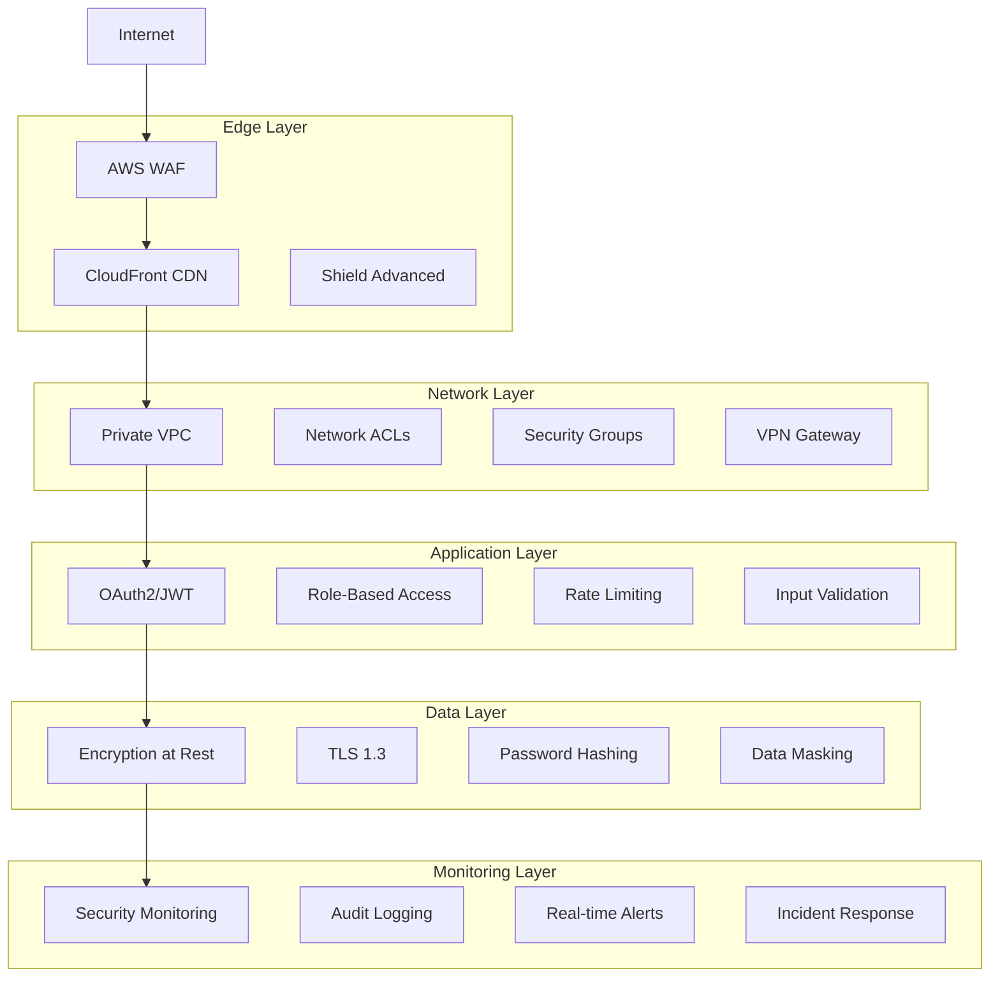

# Security Architecture Handover - WhatsOpí Platform

## Executive Summary

This document provides a comprehensive handover to the Security Agent for implementing security measures across the WhatsOpí AI-powered digital platform. The platform serves the Dominican Republic's informal economy with 100K+ concurrent users, requiring robust security architecture compliant with Dominican Law 172-13 and international standards.

## Table of Contents

1. [Security Context & Requirements](#security-context--requirements)
2. [Threat Model](#threat-model)
3. [Security Architecture Overview](#security-architecture-overview)
4. [Identity & Access Management](#identity--access-management)
5. [Data Protection & Privacy](#data-protection--privacy)
6. [Application Security](#application-security)
7. [Infrastructure Security](#infrastructure-security)
8. [API Security](#api-security)
9. [AI/ML Security](#aiml-security)
10. [Compliance Requirements](#compliance-requirements)
11. [Security Tasks Breakdown](#security-tasks-breakdown)
12. [Success Metrics](#success-metrics)

## Security Context & Requirements

### Platform Overview
WhatsOpí is a PWA + Voice Interface hybrid platform with WhatsApp Business API as the primary channel, serving:
- 100,000+ concurrent users
- Informal economy workers and micro-entrepreneurs
- Colmados (corner stores) as digital agent networks
- Multi-language support (Dominican Spanish, Haitian Creole)
- Financial services with alternative credit scoring

### Regulatory Landscape
```yaml
primary_regulations:
  dominican_law_172_13:
    scope: Personal data protection
    requirements:
      - explicit consent for data processing
      - data subject rights (access, rectification, deletion)
      - data breach notification (72 hours)
      - privacy by design principles
      - cross-border transfer restrictions
    
  pci_dss:
    scope: Payment card processing
    level: Level 1 (expected transaction volume)
    requirements:
      - secure network architecture
      - cardholder data protection
      - vulnerability management
      - access control measures
      - monitoring and testing
    
  aml_cft:
    scope: Anti-money laundering
    requirements:
      - know your customer (KYC)
      - transaction monitoring
      - suspicious activity reporting
      - record keeping
```

### Unique Security Challenges
1. **Low Digital Literacy**: Many users have limited security awareness
2. **Device Diversity**: From feature phones to smartphones
3. **Informal Economy Trust**: Historical mistrust of formal institutions
4. **Multi-Language Security**: Security messages in local dialects
5. **Colmado Integration**: Third-party agent security management
6. **Voice Interface**: Additional attack vectors through audio
7. **Offline-First**: Security for cached/synced data

## Threat Model

### High-Priority Threats
```yaml
financial_crimes:
  - money_laundering: High impact, Medium likelihood
  - fraud_schemes: High impact, High likelihood
  - identity_theft: High impact, Medium likelihood
  - payment_fraud: High impact, High likelihood
  
data_breaches:
  - personal_data_exposure: High impact, Medium likelihood
  - kyc_document_theft: Critical impact, Low likelihood
  - transaction_data: High impact, Medium likelihood
  
platform_attacks:
  - api_abuse: Medium impact, High likelihood
  - ddos_attacks: Medium impact, Medium likelihood
  - account_takeover: High impact, Medium likelihood
  - social_engineering: High impact, High likelihood
  
ai_specific:
  - prompt_injection: Medium impact, Medium likelihood
  - model_poisoning: High impact, Low likelihood
  - inference_attacks: Medium impact, Medium likelihood
  - voice_spoofing: High impact, Medium likelihood
```

### Attack Vectors
```yaml
external_threats:
  - internet_facing_apis
  - whatsapp_business_integration
  - third_party_payment_processors
  - public_webhooks
  - cdn_endpoints
  
internal_threats:
  - privileged_user_accounts
  - application_vulnerabilities
  - misconfigured_services
  - unencrypted_data_stores
  
supply_chain:
  - third_party_dependencies
  - ai_model_providers
  - payment_gateway_apis
  - cloud_service_providers
  
physical_security:
  - colmado_agent_devices
  - user_mobile_devices
  - qr_code_manipulation
```

## Security Architecture Overview

### Defense-in-Depth Strategy


### Security Zones
```yaml
dmz_zone:
  components: [WAF, CDN, Load Balancers]
  access: Internet-facing
  trust_level: Untrusted
  
application_zone:
  components: [API Gateway, Microservices, Application Servers]
  access: DMZ only
  trust_level: Semi-trusted
  
data_zone:
  components: [Databases, Redis, Message Queues]
  access: Application zone only
  trust_level: Trusted
  
management_zone:
  components: [Monitoring, Logging, Admin Tools]
  access: VPN only
  trust_level: Highly trusted
```

## Identity & Access Management

### User Authentication Architecture
```yaml
authentication_methods:
  primary:
    - whatsapp_otp: 
        security_level: Medium
        user_friction: Low
        target_users: All users
        
    - sms_otp:
        security_level: Medium
        user_friction: Medium
        target_users: Fallback option
        
  enhanced:
    - biometric_auth:
        security_level: High
        user_friction: Low
        target_users: High-value transactions
        
    - device_fingerprinting:
        security_level: Medium
        user_friction: None
        target_users: All users
        
multi_factor_authentication:
  required_for:
    - high_value_transactions: > $500 USD
    - admin_access: All admin operations
    - kyc_document_upload: Identity verification
    - colmado_agent_registration: Agent onboarding
    
  methods:
    - sms_otp: Primary
    - voice_call: Secondary
    - app_notification: For smartphone users
```

### Authorization Model
```yaml
role_based_access_control:
  roles:
    customer:
      permissions:
        - read_own_profile
        - update_own_profile
        - create_transactions
        - view_own_transactions
        - browse_products
        - create_orders
      
    merchant:
      permissions:
        - manage_products
        - view_orders
        - process_payments
        - access_analytics
        - manage_inventory
      
    colmado_agent:
      permissions:
        - process_cash_in_out
        - verify_customer_identity
        - view_transaction_history
        - generate_reports
      
    admin:
      permissions:
        - user_management
        - system_configuration
        - security_monitoring
        - compliance_reports
        
attribute_based_access:
  transaction_limits:
    - kyc_verified: $5000/day
    - phone_verified: $500/day
    - unverified: $50/day
    
  geographic_restrictions:
    - dominican_republic: full_access
    - neighboring_countries: limited_access
    - other_countries: blocked
```

### Session Management
```yaml
jwt_configuration:
  access_token:
    expiry: 15 minutes
    algorithm: RS256
    key_rotation: 24 hours
    
  refresh_token:
    expiry: 30 days
    algorithm: HS256
    one_time_use: true
    
session_security:
  concurrent_sessions: 3 max per user
  idle_timeout: 30 minutes
  absolute_timeout: 8 hours
  device_binding: enabled
  
security_headers:
  - strict_transport_security: max-age=31536000
  - content_security_policy: strict
  - x_frame_options: DENY
  - x_content_type_options: nosniff
```

## Data Protection & Privacy

### Data Classification
```yaml
data_types:
  public:
    examples: [product_catalogs, public_merchant_info]
    encryption: Not required
    access: Unrestricted
    
  internal:
    examples: [system_logs, analytics_data]
    encryption: Transit only
    access: Employee only
    
  confidential:
    examples: [user_profiles, transaction_history]
    encryption: Transit + Rest
    access: Need-to-know basis
    
  restricted:
    examples: [kyc_documents, payment_data, voice_recordings]
    encryption: Transit + Rest + Field-level
    access: Strict authorization required
```

### Encryption Strategy
```yaml
encryption_at_rest:
  database:
    method: AWS RDS encryption
    algorithm: AES-256
    key_management: AWS KMS
    key_rotation: 90 days
    
  file_storage:
    method: S3 server-side encryption
    algorithm: AES-256
    key_management: AWS KMS
    versioning: enabled
    
  field_level:
    pii_data: AES-256-GCM
    payment_data: Tokenization + AES-256
    kyc_documents: Client-side encryption
    voice_recordings: AES-256-GCM
    
encryption_in_transit:
  external_apis: TLS 1.3
  internal_services: mTLS
  database_connections: TLS 1.3
  message_queues: TLS 1.3
  
key_management:
  master_keys: AWS KMS
  application_keys: HashiCorp Vault
  rotation_schedule: 90 days
  backup_strategy: Cross-region replication
```

### Privacy Controls
```yaml
data_minimization:
  collection_principles:
    - collect_only_necessary_data
    - explicit_purpose_specification
    - limited_retention_periods
    - regular_data_purging
    
consent_management:
  consent_types:
    - essential_services: implied
    - analytics: explicit
    - marketing: explicit_opt_in
    - data_sharing: explicit_opt_in
    
  consent_withdrawal:
    - immediate_effect
    - data_deletion_within_30_days
    - notification_to_user
    
data_subject_rights:
  access_requests:
    response_time: 30 days
    format: machine_readable
    
  rectification:
    response_time: immediate
    verification_required: true
    
  deletion:
    response_time: 30 days
    exceptions: legal_obligations
    
  portability:
    response_time: 30 days
    format: JSON/CSV
```

## Application Security

### Secure Development Lifecycle
```yaml
development_practices:
  threat_modeling:
    frequency: per_feature
    methodology: STRIDE
    documentation: required
    
  static_analysis:
    tools: [SonarQube, Semgrep, CodeQL]
    coverage: 100% of code
    blocking_issues: high_severity
    
  dependency_scanning:
    tools: [Snyk, OWASP Dependency Check]
    frequency: daily
    auto_remediation: low_risk_only
    
  secrets_scanning:
    tools: [GitGuardian, TruffleHog]
    scope: all_repositories
    prevention: pre_commit_hooks
    
security_testing:
  unit_tests:
    security_test_coverage: >80%
    authentication_tests: required
    authorization_tests: required
    
  integration_tests:
    api_security_tests: all_endpoints
    authentication_flows: all_methods
    rate_limiting: all_limits
    
  penetration_testing:
    frequency: quarterly
    scope: full_application
    methodology: OWASP_ASVS
```

### Input Validation & Sanitization
```yaml
validation_rules:
  phone_numbers:
    format: E.164
    validation: regex + length
    sanitization: normalize_format
    
  financial_amounts:
    format: decimal(12,2)
    validation: positive_numbers_only
    sanitization: remove_formatting
    
  user_input:
    max_length: field_specific
    allowed_characters: whitelist
    sanitization: html_encoding
    
  file_uploads:
    allowed_types: [jpg, png, pdf]
    max_size: 10MB
    virus_scanning: required
    metadata_stripping: enabled
    
sql_injection_prevention:
  parameterized_queries: required
  stored_procedures: preferred
  orm_usage: encouraged
  input_escaping: secondary_defense
  
xss_prevention:
  output_encoding: context_aware
  content_security_policy: strict
  input_sanitization: server_side
  dom_purification: client_side
```

### API Security
```yaml
authentication:
  bearer_tokens: JWT with RS256
  api_keys: for_service_to_service
  oauth2: for_third_party_integrations
  rate_limiting: per_client_id
  
authorization:
  scope_based: granular_permissions
  resource_based: data_ownership
  time_based: temporary_access
  location_based: geographic_restrictions
  
request_validation:
  schema_validation: openapi_specs
  size_limits: per_endpoint
  timeout_limits: 30_seconds_max
  compression: gzip_only
  
response_security:
  sensitive_data_filtering: enabled
  error_message_sanitization: production_mode
  correlation_ids: for_tracking
  security_headers: comprehensive
```

## Infrastructure Security

### Network Security
```yaml
vpc_configuration:
  cidr_blocks: non_overlapping
  subnets: multi_az_deployment
  internet_gateway: public_subnets_only
  nat_gateway: private_subnet_access
  
security_groups:
  principle: least_privilege
  rules: explicit_allow_only
  source: security_group_references
  logging: vpc_flow_logs
  
network_access_control:
  public_subnet: web_traffic_only
  private_subnet: application_traffic
  database_subnet: database_traffic_only
  management_subnet: admin_access_only
  
intrusion_detection:
  aws_guardduty: enabled
  custom_rules: whatsapp_specific
  threat_intelligence: integrated
  response_automation: lambda_functions
```

### Container Security
```yaml
image_security:
  base_images: distroless_preferred
  vulnerability_scanning: enabled
  security_updates: automated
  image_signing: required
  
runtime_security:
  non_root_user: enforced
  read_only_filesystem: preferred
  capability_dropping: minimal_set
  seccomp_profiles: enabled
  
kubernetes_security:
  rbac: enabled
  pod_security_standards: restricted
  network_policies: enabled
  admission_controllers: comprehensive
  
secrets_management:
  kubernetes_secrets: encrypted
  external_secrets: vault_integration
  rotation: automated
  access_logging: enabled
```

### Cloud Security
```yaml
aws_security_services:
  config: compliance_monitoring
  cloudtrail: api_logging
  security_hub: centralized_findings
  inspector: vulnerability_assessment
  
iam_security:
  principle: least_privilege
  mfa_required: admin_accounts
  password_policy: strong_requirements
  access_keys: temporary_only
  
monitoring_alerting:
  cloudwatch: metrics_and_logs
  third_party_siem: log_aggregation
  real_time_alerts: security_events
  incident_response: automated_workflows
```

## AI/ML Security

### Model Security
```yaml
model_protection:
  inference_apis:
    rate_limiting: per_user_limits
    input_validation: strict_schemas
    output_filtering: sensitive_data_removal
    
  prompt_injection:
    detection: pattern_matching
    prevention: input_sanitization
    monitoring: suspicious_patterns
    
  model_privacy:
    differential_privacy: training_data
    federated_learning: user_data
    model_extraction: protection_measures
    
voice_interface_security:
  audio_validation:
    format_verification: supported_codecs
    duration_limits: max_60_seconds
    size_limits: max_10mb
    
  speaker_verification:
    voice_biometrics: optional_feature
    anti_spoofing: deepfake_detection
    replay_attack: prevention_measures
    
  privacy_protection:
    audio_encryption: end_to_end
    temporary_storage: auto_deletion
    processing_logs: no_audio_storage
```

### AI Governance
```yaml
responsible_ai:
  bias_detection:
    testing_frequency: monthly
    demographic_parity: monitored
    equalized_odds: measured
    
  explainability:
    model_interpretability: required
    decision_explanations: user_facing
    audit_trails: comprehensive
    
  transparency:
    model_cards: published
    data_sources: documented
    limitations: clearly_stated
    
algorithmic_accountability:
  human_oversight:
    high_risk_decisions: required
    appeal_process: available
    manual_review: option
    
  performance_monitoring:
    accuracy_tracking: continuous
    drift_detection: automated
    retraining_triggers: defined
```

## Compliance Requirements

### Dominican Law 172-13 Implementation
```yaml
legal_basis:
  data_processing:
    consent: explicit_informed
    legitimate_interest: business_operations
    legal_obligation: kyc_requirements
    
data_controller_obligations:
  privacy_notice:
    language: spanish_creole
    comprehension_level: elementary
    delivery_method: multiple_channels
    
  consent_management:
    granular_consent: per_purpose
    withdrawal_mechanism: easy_access
    consent_records: detailed_logs
    
  data_protection_officer:
    appointment: required
    qualifications: certified
    independence: guaranteed
    
breach_notification:
  internal_notification: immediate
  authority_notification: 72_hours
  data_subject_notification: without_delay
  documentation: comprehensive
```

### PCI DSS Compliance
```yaml
cardholder_data_environment:
  scope_reduction:
    tokenization: payment_data
    encryption: sensitive_data
    segmentation: network_isolation
    
security_requirements:
  firewall_configuration: restrictive_rules
  default_passwords: changed_immediately
  cardholder_data_protection: encrypted_storage
  transmission_encryption: tls_required
  antivirus_software: updated_regularly
  secure_systems: vulnerability_management
  
access_controls:
  unique_ids: per_user
  authentication: multi_factor
  physical_access: restricted
  network_access: limited
  
monitoring_testing:
  logging: comprehensive
  log_monitoring: real_time
  penetration_testing: quarterly
  vulnerability_scanning: monthly
```

### AML/CFT Compliance
```yaml
customer_due_diligence:
  identity_verification:
    document_verification: automated_manual
    biometric_verification: facial_recognition
    address_verification: utility_bills
    
  enhanced_due_diligence:
    high_risk_customers: manual_review
    politically_exposed_persons: screening
    beneficial_ownership: identification
    
transaction_monitoring:
  automated_screening:
    sanctions_lists: real_time
    suspicious_patterns: ml_algorithms
    threshold_monitoring: configurable
    
  suspicious_activity_reporting:
    detection_criteria: defined
    investigation_process: documented
    reporting_timeline: compliant
    
record_keeping:
  retention_period: 5_years_minimum
  data_integrity: immutable_logs
  accessibility: audit_ready
```

## Security Tasks Breakdown

### High Priority Tasks (Week 1-2)
```yaml
immediate_security:
  - implement_waf_rules
  - configure_api_gateway_throttling
  - set_up_jwt_authentication
  - enable_database_encryption
  - implement_input_validation
  - configure_security_headers
  - set_up_basic_monitoring
  
critical_configurations:
  - tls_certificates_installation
  - security_group_hardening
  - iam_policy_creation
  - secrets_manager_setup
  - backup_encryption_verification
```

### Medium Priority Tasks (Week 3-4)
```yaml
enhanced_security:
  - implement_mfa_flows
  - set_up_fraud_detection
  - configure_vulnerability_scanning
  - implement_audit_logging
  - set_up_incident_response
  - configure_data_loss_prevention
  
compliance_preparation:
  - privacy_policy_implementation
  - consent_management_system
  - data_subject_rights_portal
  - breach_notification_procedures
```

### Long-term Tasks (Month 2-3)
```yaml
advanced_security:
  - penetration_testing_program
  - security_awareness_training
  - threat_hunting_capabilities
  - advanced_threat_detection
  - security_orchestration
  
compliance_certification:
  - pci_dss_assessment
  - privacy_impact_assessments
  - security_audit_preparation
  - compliance_documentation
```

## Success Metrics

### Security KPIs
```yaml
preventive_metrics:
  - vulnerability_scan_coverage: >95%
  - security_training_completion: >90%
  - patch_deployment_time: <72_hours
  - security_policy_compliance: >98%
  
detective_metrics:
  - mean_time_to_detection: <5_minutes
  - false_positive_rate: <10%
  - security_event_coverage: >99%
  - incident_escalation_time: <15_minutes
  
responsive_metrics:
  - mean_time_to_response: <30_minutes
  - incident_resolution_time: <4_hours
  - recovery_time_objective: <1_hour
  - communication_effectiveness: >95%
```

### Compliance Metrics
```yaml
regulatory_compliance:
  - law_172_13_compliance: 100%
  - pci_dss_compliance: level_1
  - audit_findings: zero_critical
  - privacy_violations: zero
  
business_metrics:
  - customer_trust_score: >4.5/5
  - security_incident_impact: <$10k
  - compliance_cost_ratio: <5%
  - security_roi: >300%
```

## Next Steps

### Immediate Actions Required
1. **Review Architecture**: Validate security architecture against business requirements
2. **Risk Assessment**: Conduct detailed risk assessment for each component
3. **Security Policies**: Develop comprehensive security policies and procedures
4. **Tool Selection**: Choose and configure security tools and services
5. **Team Training**: Provide security training for development and operations teams

### Key Deliverables Expected
1. **Security Implementation Plan**: Detailed timeline and resource requirements
2. **Security Policies Document**: Comprehensive security policies and procedures
3. **Incident Response Plan**: Step-by-step incident response procedures
4. **Compliance Checklist**: Detailed compliance requirements and validation
5. **Security Testing Plan**: Comprehensive security testing strategy

### Coordination Points
- Weekly security review meetings with architecture and development teams
- Bi-weekly compliance check-ins with legal and business teams
- Monthly security metrics review with executive leadership
- Quarterly security assessment and improvement planning

---

*This handover provides the Security Agent with comprehensive context and detailed requirements to implement robust security measures for the WhatsOpí platform while ensuring compliance with all relevant regulations.*