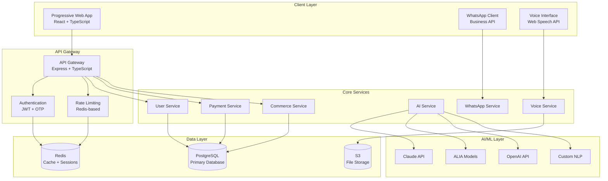

# WhatsOpí Developer Guide

*Complete Technical Development Documentation for Dominican Republic's Informal Economy Platform*

---

## 📋 Overview

Welcome to the WhatsOpí Developer Guide. This comprehensive documentation provides everything you need to understand, contribute to, and extend the WhatsOpí platform - an AI-powered digital platform specifically designed for the Dominican Republic's informal economy.

### 🎯 What Makes WhatsOpí Unique

- **Cultural Intelligence**: Deep understanding of Dominican Spanish and Haitian Creole
- **Offline-First Architecture**: PWA with comprehensive offline functionality
- **WhatsApp Integration**: Primary interface through WhatsApp Business API
- **Voice-First Design**: Caribbean accent-optimized speech recognition
- **AI-Powered**: Multi-provider AI system with Claude, ALIA, and OpenAI
- **Compliance-Ready**: Dominican Law 172-13 and PCI DSS Level 1 compliant

---

## 🚀 Quick Start

### Prerequisites

Before you begin, ensure you have:

- **Node.js 20 LTS** or higher
- **npm** or **pnpm** (recommended)
- **PostgreSQL 15** or higher
- **Redis 7** or higher
- **Git** for version control
- **Docker** (optional, for containerized development)

### Environment Setup

1. **Clone the Repository**
```bash
git clone https://github.com/exxede/whatsopi.git
cd whatsopi
```

2. **Install Dependencies**
```bash
# Root dependencies
npm install

# API server dependencies
cd src/api && npm install && cd ../..
```

3. **Environment Configuration**
```bash
# Copy environment templates
cp .env.example .env.development
cp src/api/.env.example src/api/.env.development

# Edit configuration files with your settings
```

4. **Database Setup**
```bash
# Start PostgreSQL and Redis (if using Docker)
docker-compose -f docker-compose.dev.yml up -d postgres redis

# Generate Prisma client
cd src/api && npm run db:generate

# Run migrations
npm run db:migrate

# Seed development data
npm run db:seed
```

5. **Start Development Servers**
```bash
# Terminal 1: Start API server
cd src/api && npm run dev

# Terminal 2: Start frontend
npm run dev
```

6. **Verify Installation**
```bash
# Check API health
curl http://localhost:3001/health

# Check frontend
open http://localhost:5173
```

---

## 🏗️ Architecture Deep Dive

### System Architecture

WhatsOpí follows a modern microservices architecture optimized for the Dominican market:



### Technology Stack

#### Frontend Stack
```yaml
framework: React 18 with TypeScript
build_tool: Vite 5
styling: Tailwind CSS 3.x
state_management: Zustand + React Query
routing: React Router v6
pwa: Vite PWA Plugin + Workbox
offline_storage: Dexie (IndexedDB)
voice: Web Speech API
testing: Vitest + React Testing Library
```

#### Backend Stack
```yaml
runtime: Node.js 20 LTS
language: TypeScript 5.x
framework: Express.js
database: PostgreSQL 15 + Prisma ORM
cache: Redis 7
queue: Bull (Redis-based)
auth: JWT with RS256
encryption: AES-256-GCM
logging: Winston + structured logging
monitoring: Prometheus metrics
```

#### AI/ML Stack
```yaml
primary_llm: Anthropic Claude (Opus 4)
spanish_nlp: ALIA (Custom Dominican Spanish)
creole_nlp: Custom Haitian Creole models
fallback_llm: OpenAI GPT-4
voice_processing: Web Speech API + AWS Polly
vector_storage: Pinecone (for RAG)
ml_framework: TensorFlow.js
```

---

## 💻 Development Workflow

### Git Workflow

We follow **GitFlow** with some Dominican-specific conventions:

```bash
# Branch naming convention
feature/WHOP-123-dominican-phone-validation
bugfix/WHOP-456-voice-recognition-creole
hotfix/WHOP-789-payment-processing-fix
cultural/WHOP-321-spanish-expressions-update

# Commit message format
feat(auth): add Dominican phone number validation
fix(voice): improve Haitian Creole recognition accuracy
docs(api): update Dominican Spanish endpoints
cultural(nlp): add new Dominican expressions
```

### Code Standards

#### TypeScript Configuration
```typescript
// tsconfig.json - Strict configuration
{
  "compilerOptions": {
    "strict": true,
    "noImplicitAny": true,
    "noImplicitReturns": true,
    "noUnusedLocals": true,
    "noUnusedParameters": true,
    "exactOptionalPropertyTypes": true
  }
}
```

#### ESLint Rules
```javascript
// .eslintrc.js - Custom rules for Dominican context
module.exports = {
  extends: [
    '@typescript-eslint/recommended',
    'plugin:react-hooks/recommended'
  ],
  rules: {
    // Cultural content rules
    'dominican-expressions/validate-slang': 'warn',
    'dominican-expressions/prefer-local-terms': 'error',
    
    // Code quality
    'prefer-const': 'error',
    'no-var': 'error',
    '@typescript-eslint/explicit-function-return-type': 'error'
  }
}
```

#### File Naming Conventions
```
components/         # React components
├── auth/
│   ├── LoginPage.tsx          # PascalCase for components
│   └── login-page.test.tsx    # kebab-case for tests
├── common/
│   ├── LoadingSpinner.tsx
│   └── loading-spinner.stories.tsx
└── voice/
    ├── VoiceButton.tsx
    └── voice-button.test.tsx

lib/                # Shared libraries
├── api/
│   ├── auth-service.ts        # kebab-case for utilities
│   └── payment-service.ts
└── voice/
    ├── speech-recognition.ts
    └── audio-processing.ts

types/              # Type definitions
├── api.ts                     # API types
├── user.ts                    # User-related types  
└── dominican-types.ts         # Dominican-specific types
```

### Development Commands

```bash
# Development
npm run dev                    # Start development server
npm run dev:api               # Start API server only
npm run dev:frontend          # Start frontend only

# Code Quality
npm run typecheck             # TypeScript type checking
npm run lint                  # ESLint check
npm run lint:fix              # Fix ESLint issues
npm run format                # Prettier code formatting

# Testing
npm run test                  # Run all tests
npm run test:watch            # Watch mode for tests
npm run test:coverage         # Generate coverage report
npm run test:cultural         # Dominican cultural tests
npm run test:voice            # Voice recognition tests
npm run test:whatsapp         # WhatsApp integration tests

# Building
npm run build                 # Development build
npm run build:prod            # Production build with optimizations
npm run build:analyze         # Bundle size analysis

# Database
npm run db:generate           # Generate Prisma client
npm run db:migrate            # Run database migrations
npm run db:seed               # Seed development data
npm run db:reset              # Reset database (development only)
```

---

## 🌍 Cultural Development Guidelines

### Dominican Spanish Integration

WhatsOpí is deeply integrated with Dominican culture. Here are key guidelines:

#### Language Processing
```typescript
// Dominican Spanish expressions mapping
const dominicanExpressions = {
  // Greetings
  'klk': ['¿qué tal?', 'hola', 'que lo que'],
  'que lo que': ['¿cómo estás?', '¿cómo tú tá?'],
  'tiguer': ['amigo', 'pana', 'hermano'],
  
  // Business terms
  'colmado': ['tienda', 'negocio', 'establecimiento'],
  'chin': ['poco', 'pequeño'],
  'jevi': ['bueno', 'bien', 'perfecto'],
  
  // Money and payments
  'peso': ['RD$', 'pesos dominicanos'],
  'chelito': ['dinero', 'efectivo'],
  'fiado': ['crédito', 'a cuenta']
};

// Usage in NLP processing
function processDominicanText(text: string): ProcessedText {
  return {
    normalized: normalizeDominicanExpressions(text),
    culturalMarkers: extractCulturalMarkers(text),
    formalityLevel: determineFormalityLevel(text),
    businessContext: extractBusinessContext(text)
  };
}
```

#### Phone Number Validation
```typescript
// Dominican phone number patterns
const DOMINICAN_PHONE_PATTERNS = {
  mobile: /^(\+1)?(809|829|849)[0-9]{7}$/,
  landline: /^(\+1)?809[0-9]{7}$/,
  whatsapp: /^(\+1)?(809|829|849)[0-9]{7}$/
};

function validateDominicanPhone(phone: string): PhoneValidation {
  const cleaned = phone.replace(/[^\d+]/g, '');
  
  return {
    isValid: DOMINICAN_PHONE_PATTERNS.mobile.test(cleaned),
    type: detectPhoneType(cleaned),
    formatted: formatDominicanPhone(cleaned),
    carrier: detectCarrier(cleaned) // CLARO, ORANGE, VIVA
  };
}
```

#### Currency Formatting
```typescript
// Dominican peso formatting
function formatDominicanCurrency(amount: number): string {
  return new Intl.NumberFormat('es-DO', {
    style: 'currency',
    currency: 'DOP',
    minimumFractionDigits: 2,
    currencyDisplay: 'symbol' // Shows RD$
  }).format(amount);
}

// Example: formatDominicanCurrency(1500) => "RD$1,500.00"
```

### Haitian Creole Support

```typescript
// Haitian Creole language processing
const creoleExpressions = {
  // Greetings
  'sak_pase': ['¿qué tal?', 'hola'],
  'nap_boule': ['estamos bien', 'todo bien'],
  'koman_ou_ye': ['¿cómo estás?'],
  
  // Business terms
  'mwen_bezwen': ['necesito', 'quiero'],
  'konben': ['cuánto', 'precio'],
  'kote': ['dónde', 'ubicación']
};

function processCreoleText(text: string): ProcessedText {
  return {
    normalized: normalizeCreoleText(text),
    spanishTranslation: translateCreoleToSpanish(text),
    codeSwitching: detectCodeSwitching(text),
    culturalContext: extractHaitianCulturalContext(text)
  };
}
```

### Cultural Testing

```typescript
// Cultural appropriateness tests
describe('Dominican Cultural Integration', () => {
  test('should recognize Dominican greetings', () => {
    const text = 'Klk tiguer, que lo que';
    const result = processDominicanText(text);
    
    expect(result.culturalMarkers).toContain('informal_greeting');
    expect(result.formalityLevel).toBe('casual');
    expect(result.businessContext).toBe('friendly');
  });

  test('should handle Dominican business terms', () => {
    const text = 'Busco arroz en el colmado';
    const result = processDominicanText(text);
    
    expect(result.businessContext).toBe('commerce');
    expect(result.normalized).toContain('establecimiento');
  });
});

describe('Haitian Creole Integration', () => {
  test('should detect code-switching', () => {
    const text = 'Klk pero mwen pa konprann';
    const result = processCreoleText(text);
    
    expect(result.codeSwitching.detected).toBe(true);
    expect(result.codeSwitching.languages).toEqual(['es-DO', 'ht']);
  });
});
```

---

## 🗣️ Voice Interface Development

### Speech Recognition Setup

```typescript
// Voice recognition configuration for Caribbean accents
interface VoiceConfig {
  language: 'es-DO' | 'ht' | 'en';
  continuous: boolean;
  interimResults: boolean;
  maxAlternatives: number;
  grammars?: SpeechGrammarList;
}

class DominicanVoiceRecognition {
  private recognition: SpeechRecognition;
  private audioContext: AudioContext;
  
  constructor(config: VoiceConfig) {
    this.recognition = new webkitSpeechRecognition();
    this.setupRecognition(config);
    this.setupAudioProcessing();
  }

  private setupRecognition(config: VoiceConfig): void {
    this.recognition.lang = this.mapLanguageCode(config.language);
    this.recognition.continuous = config.continuous;
    this.recognition.interimResults = config.interimResults;
    this.recognition.maxAlternatives = config.maxAlternatives;
    
    // Dominican Spanish acoustic model optimizations
    if (config.language === 'es-DO') {
      this.recognition.serviceURI = 'dominican-speech-service';
    }
  }

  private mapLanguageCode(lang: string): string {
    const languageMap = {
      'es-DO': 'es-DO', // Dominican Spanish
      'ht': 'ht-HT',    // Haitian Creole
      'en': 'en-US'     // English fallback
    };
    return languageMap[lang] || 'es-DO';
  }

  async processVoiceCommand(audioBlob: Blob): Promise<VoiceResult> {
    const transcript = await this.transcribeAudio(audioBlob);
    const processed = await this.processTranscript(transcript);
    
    return {
      transcript: transcript.text,
      confidence: transcript.confidence,
      language: transcript.detectedLanguage,
      intent: processed.intent,
      entities: processed.entities,
      culturalMarkers: processed.culturalMarkers
    };
  }
}
```

### Voice Command Processing

```typescript
// Dominican voice command patterns
const VOICE_COMMAND_PATTERNS = {
  // Commerce commands
  search_product: [
    /busco? (.+) en (colmados?|tiendas?) cerca/i,
    /necesito (.+)/i,
    /¿?dónde hay (.+)\??/i,
    /mwen bezwen (.+)/i  // Haitian Creole
  ],
  
  // Payment commands
  send_money: [
    /enviar (\d+) pesos? a (.+)/i,
    /mandar dinero a (.+)/i,
    /voye (\d+) bay (.+)/i  // Haitian Creole
  ],
  
  // Help commands
  get_help: [
    /ayuda/i,
    /help/i,
    /no entiendo/i,
    /mwen pa konprann/i  // Haitian Creole
  ]
};

function classifyVoiceIntent(transcript: string): VoiceIntent {
  for (const [intent, patterns] of Object.entries(VOICE_COMMAND_PATTERNS)) {
    for (const pattern of patterns) {
      const match = transcript.match(pattern);
      if (match) {
        return {
          intent,
          entities: extractEntities(match),
          confidence: calculatePatternConfidence(match)
        };
      }
    }
  }
  
  return { intent: 'unknown', entities: {}, confidence: 0 };
}
```

### Audio Processing

```typescript
// Audio enhancement for Caribbean accents
class AudioProcessor {
  private audioContext: AudioContext;
  private analyzer: AnalyserNode;
  
  constructor() {
    this.audioContext = new AudioContext();
    this.analyzer = this.audioContext.createAnalyser();
  }

  async enhanceAudioForCaribbean(audioBuffer: AudioBuffer): Promise<AudioBuffer> {
    // Apply Caribbean-specific audio processing
    const processed = this.audioContext.createBuffer(
      audioBuffer.numberOfChannels,
      audioBuffer.length,
      audioBuffer.sampleRate
    );

    for (let channel = 0; channel < audioBuffer.numberOfChannels; channel++) {
      const inputData = audioBuffer.getChannelData(channel);
      const outputData = processed.getChannelData(channel);
      
      // Apply noise reduction
      this.applyNoiseReduction(inputData, outputData);
      
      // Enhance speech frequencies common in Dominican Spanish
      this.enhanceSpeechFrequencies(outputData);
      
      // Normalize volume
      this.normalizeVolume(outputData);
    }

    return processed;
  }

  private applyNoiseReduction(input: Float32Array, output: Float32Array): void {
    // Apply spectral subtraction for noise reduction
    // Optimized for typical Dominican environment noise
  }

  private enhanceSpeechFrequencies(data: Float32Array): void {
    // Boost frequencies common in Dominican Spanish pronunciation
    // Handle aspiration, r-weakening, and other phonetic features
  }
}
```

---

## 💰 Payment System Integration

### Payment Provider Architecture

```typescript
// Multi-provider payment system
interface PaymentProvider {
  id: string;
  name: string;
  supportedCurrencies: string[];
  supportedCountries: string[];
  processingFee: number;
  settlementTime: string;
}

class PaymentProviderManager {
  private providers: Map<string, PaymentProvider>;

  constructor() {
    this.providers = new Map([
      ['tpago', new TpagoProvider()],
      ['paypal', new PayPalProvider()],
      ['stripe', new StripeProvider()],
      ['dominican_banks', new DominicanBankProvider()]
    ]);
  }

  async processPayment(request: PaymentRequest): Promise<PaymentResult> {
    const provider = this.selectOptimalProvider(request);
    
    try {
      const result = await provider.processPayment(request);
      await this.recordTransaction(result);
      return result;
    } catch (error) {
      return this.handlePaymentFailure(error, request);
    }
  }

  private selectOptimalProvider(request: PaymentRequest): PaymentProvider {
    // Selection logic based on:
    // - Amount and currency
    // - Recipient location
    // - User preferences
    // - Provider availability
    // - Cost optimization
    
    if (request.currency === 'DOP' && request.amount < 10000) {
      return this.providers.get('tpago');
    }
    
    if (request.recipient.country === 'HT') {
      return this.providers.get('haitian_remittance');
    }
    
    return this.providers.get('paypal');
  }
}
```

### Dominican Payment Methods

```typescript
// tPago integration (Dominican mobile money)
class TpagoProvider implements PaymentProvider {
  private apiClient: TpagoAPIClient;

  async processPayment(request: PaymentRequest): Promise<PaymentResult> {
    const tpagoRequest = this.convertToTpagoFormat(request);
    
    const response = await this.apiClient.createPayment({
      sender: {
        phone: request.sender.phone,
        pin: request.sender.tpagoPin
      },
      recipient: {
        phone: request.recipient.phone
      },
      amount: request.amount,
      currency: 'DOP',
      description: request.description
    });

    return {
      transactionId: response.transactionId,
      status: this.mapTpagoStatus(response.status),
      fees: response.fees,
      estimatedSettlement: response.settlementTime
    };
  }

  private convertToTpagoFormat(request: PaymentRequest): TpagoPaymentRequest {
    return {
      // Convert WhatsOpí payment request to tPago format
      // Handle Dominican phone number formatting
      // Apply local business rules
    };
  }
}

// Dominican bank integration
class DominicanBankProvider implements PaymentProvider {
  private bankConnections: Map<string, BankAPI>;

  constructor() {
    this.bankConnections = new Map([
      ['BHD', new BHDLeonAPI()],
      ['POPULAR', new BancoPopularAPI()],
      ['RESERVAS', new BanReservasAPI()],
      ['SCOTIABANK', new ScotiabankAPI()]
    ]);
  }

  async processTransfer(request: BankTransferRequest): Promise<TransferResult> {
    const bank = this.identifyBank(request.accountNumber);
    const api = this.bankConnections.get(bank);
    
    return await api.processTransfer({
      fromAccount: request.fromAccount,
      toAccount: request.toAccount,
      amount: request.amount,
      currency: 'DOP',
      reference: request.reference
    });
  }

  private identifyBank(accountNumber: string): string {
    // Identify Dominican bank from account number format
    const bankPrefixes = {
      'BHD': /^(100|101|102)/,
      'POPULAR': /^(200|201|202)/,
      'RESERVAS': /^(300|301|302)/,
      'SCOTIABANK': /^(400|401|402)/
    };

    for (const [bank, pattern] of Object.entries(bankPrefixes)) {
      if (pattern.test(accountNumber)) {
        return bank;
      }
    }

    throw new Error(`Unknown bank for account: ${accountNumber}`);
  }
}
```

### Transaction Monitoring

```typescript
// Real-time transaction monitoring
class TransactionMonitor {
  private fraudDetector: FraudDetector;
  private complianceChecker: ComplianceChecker;

  async monitorTransaction(transaction: Transaction): Promise<MonitoringResult> {
    const results = await Promise.all([
      this.fraudDetector.analyze(transaction),
      this.complianceChecker.validate(transaction),
      this.checkDominicanLimits(transaction)
    ]);

    return {
      fraudScore: results[0].score,
      complianceStatus: results[1].status,
      limitStatus: results[2].status,
      requiresReview: this.shouldReviewTransaction(results)
    };
  }

  private async checkDominicanLimits(transaction: Transaction): Promise<LimitCheckResult> {
    // Check against Dominican financial regulations
    const userLimits = await this.getUserLimits(transaction.userId);
    const dailyTotal = await this.getDailyTransactionTotal(transaction.userId);
    
    return {
      dailyLimitExceeded: (dailyTotal + transaction.amount) > userLimits.daily,
      monthlyLimitExceeded: await this.checkMonthlyLimit(transaction),
      kycRequired: this.requiresKYCUpgrade(transaction, userLimits)
    };
  }
}
```

---

## 🔐 Security Implementation

### Authentication System

```typescript
// Multi-factor authentication with Dominican optimizations
class DominicanAuthService {
  private otpService: OTPService;
  private jwtService: JWTService;

  async authenticateWithOTP(phone: string, method: 'whatsapp' | 'sms'): Promise<AuthResult> {
    // Validate Dominican phone number
    const validation = validateDominicanPhone(phone);
    if (!validation.isValid) {
      throw new ValidationError('Invalid Dominican phone number');
    }

    // Generate and send OTP
    const otp = this.otpService.generate();
    await this.sendOTP(phone, otp, method);

    return {
      otpSent: true,
      method,
      expiresIn: 600, // 10 minutes
      maskedPhone: this.maskPhone(phone)
    };
  }

  private async sendOTP(phone: string, otp: string, method: string): Promise<void> {
    if (method === 'whatsapp') {
      await this.sendWhatsAppOTP(phone, otp);
    } else {
      await this.sendSMSOTP(phone, otp);
    }
  }

  private async sendWhatsAppOTP(phone: string, otp: string): Promise<void> {
    const message = `Tu código de verificación WhatsOpí es: ${otp}\n\n¡No lo compartas con nadie!\n\nExpira en 10 minutos.`;
    
    await this.whatsappService.sendMessage({
      to: phone,
      type: 'text',
      text: { body: message }
    });
  }
}
```

### Encryption and Data Protection

```typescript
// Field-level encryption for sensitive data
class DataEncryption {
  private encryptionKey: string;
  private algorithm = 'aes-256-gcm';

  constructor() {
    this.encryptionKey = process.env.ENCRYPTION_KEY;
  }

  encryptField(data: any, fieldType: FieldType): EncryptedField {
    const cipher = crypto.createCipher(this.algorithm, this.encryptionKey);
    const iv = crypto.randomBytes(16);
    
    cipher.setAAD(Buffer.from(fieldType, 'utf8'));
    
    let encrypted = cipher.update(JSON.stringify(data), 'utf8', 'hex');
    encrypted += cipher.final('hex');
    
    const authTag = cipher.getAuthTag();

    return {
      _encrypted: true,
      algorithm: this.algorithm,
      iv: iv.toString('hex'),
      data: encrypted,
      authTag: authTag.toString('hex'),
      keyId: this.getKeyId()
    };
  }

  decryptField(encryptedField: EncryptedField): any {
    const decipher = crypto.createDecipher(this.algorithm, this.encryptionKey);
    
    decipher.setAuthTag(Buffer.from(encryptedField.authTag, 'hex'));
    
    let decrypted = decipher.update(encryptedField.data, 'hex', 'utf8');
    decrypted += decipher.final('utf8');
    
    return JSON.parse(decrypted);
  }
}

// Usage in database models
class UserRepository {
  async saveUser(userData: UserData): Promise<User> {
    const encryptedUser = {
      ...userData,
      personalInfo: this.encryption.encryptField(userData.personalInfo, FieldType.PII),
      cedula: this.encryption.encryptField(userData.cedula, FieldType.DOMINICAN_ID),
      phoneNumber: this.encryption.encryptField(userData.phoneNumber, FieldType.PHONE)
    };

    return await this.db.user.create({ data: encryptedUser });
  }
}
```

### Compliance Framework

```typescript
// Dominican Law 172-13 compliance
class DominicanDataProtectionCompliance {
  async handleDataSubjectRequest(
    userId: string,
    requestType: DataSubjectRequestType,
    language: 'es-DO' | 'ht' | 'en' = 'es-DO'
  ): Promise<DataSubjectResponse> {
    
    switch (requestType) {
      case 'ACCESS':
        return await this.handleAccessRequest(userId, language);
      case 'RECTIFICATION':
        return await this.handleRectificationRequest(userId, language);
      case 'ERASURE':
        return await this.handleErasureRequest(userId, language);
      case 'PORTABILITY':
        return await this.handlePortabilityRequest(userId, language);
    }
  }

  private async handleAccessRequest(userId: string, language: string): Promise<DataSubjectResponse> {
    const userData = await this.collectUserData(userId);
    const response = this.formatDataForUser(userData, language);
    
    // Log compliance action
    await this.auditLogger.logComplianceAction({
      action: 'DATA_ACCESS_REQUEST',
      userId,
      timestamp: new Date(),
      dataProvided: Object.keys(userData),
      language
    });

    return {
      status: 'completed',
      data: response,
      format: 'json',  // Also support CSV, XML
      language,
      generatedAt: new Date(),
      retentionNotice: this.getRetentionNotice(language)
    };
  }

  private getRetentionNotice(language: string): string {
    const notices = {
      'es-DO': 'Conservamos tus datos según la Ley 172-13 de República Dominicana. Tienes derecho a solicitar corrección o eliminación en cualquier momento.',
      'ht': 'Nou konsève done ou yo selon Lalwa 172-13 nan Repiblik Dominikèn. Ou gen dwa mande koreksyon oswa efasè nan nenpòt ki moman.',
      'en': 'We retain your data according to Dominican Law 172-13. You have the right to request correction or deletion at any time.'
    };
    
    return notices[language] || notices['es-DO'];
  }
}
```

---

## 🧪 Testing Strategy

### Testing Philosophy

WhatsOpí employs comprehensive testing with cultural awareness:

```typescript
// Cultural testing utilities
class CulturalTestUtils {
  static dominicanTextSamples = [
    'Klk tiguer, que lo que',
    'Busco pollo en el colmado',
    '¿Cuánto vale el arroz Diana?',
    'Envía 500 pesos a mi hermana'
  ];

  static haitianCreoleSamples = [
    'Sak pase, nap boule',
    'Mwen bezwen achte diri',
    'Konben poul la koute?',
    'Voye lajan bay manman m'
  ];

  static dominicanPhoneNumbers = [
    '+18091234567',
    '8291234567',
    '849-123-4567'
  ];

  static generateDominicanTestUser(): TestUser {
    return {
      firstName: faker.name.firstName('es-DO'),
      lastName: faker.name.lastName('es-DO'),
      phoneNumber: this.getRandomDominicanPhone(),
      cedula: this.generateDominicanCedula(),
      municipality: faker.helpers.arrayElement([
        'Santo Domingo', 'Santiago', 'San Pedro de Macorís',
        'La Romana', 'Puerto Plata', 'San Cristóbal'
      ])
    };
  }
}
```

### Unit Testing Examples

```typescript
// Voice recognition tests
describe('Dominican Voice Recognition', () => {
  test('should recognize Dominican greetings with high confidence', async () => {
    const voiceProcessor = new DominicanVoiceProcessor();
    
    for (const greeting of CulturalTestUtils.dominicanTextSamples) {
      const result = await voiceProcessor.processText(greeting);
      
      expect(result.confidence).toBeGreaterThanOrEqual(0.95);
      expect(result.language).toBe('es-DO');
      expect(result.culturalMarkers.length).toBeGreaterThan(0);
    }
  });

  test('should handle code-switching between Spanish and Creole', async () => {
    const mixedText = 'Klk pero mwen pa konprann';
    const result = await voiceProcessor.processText(mixedText);
    
    expect(result.codeSwitching.detected).toBe(true);
    expect(result.codeSwitching.languages).toContain('es-DO');
    expect(result.codeSwitching.languages).toContain('ht');
  });
});

// Payment system tests
describe('Dominican Payment Processing', () => {
  test('should process tPago payments correctly', async () => {
    const paymentRequest = {
      amount: 1500.00,
      currency: 'DOP',
      sender: { phone: '+18091234567' },
      recipient: { phone: '+18099876543' },
      method: 'tpago'
    };

    const result = await paymentService.processPayment(paymentRequest);
    
    expect(result.status).toBe('completed');
    expect(result.fees).toBeLessThanOrEqual(50); // Max 50 pesos fee
    expect(result.currency).toBe('DOP');
  });

  test('should validate Dominican phone numbers for payments', async () => {
    const invalidPhones = ['123456', '+1555123456', '999-999-9999'];
    
    for (const phone of invalidPhones) {
      await expect(
        paymentService.processPayment({ 
          sender: { phone },
          recipient: { phone: '+18091234567' },
          amount: 100
        })
      ).rejects.toThrow('Invalid Dominican phone number');
    }
  });
});
```

### Integration Testing

```typescript
// WhatsApp integration tests
describe('WhatsApp Business API Integration', () => {
  let whatsappService: WhatsAppService;
  
  beforeEach(() => {
    whatsappService = new WhatsAppService(testConfig);
  });

  test('should send OTP messages in Dominican Spanish', async () => {
    const phone = '+18091234567';
    const otp = '123456';
    
    const result = await whatsappService.sendOTP(phone, otp, 'es-DO');
    
    expect(result.messageId).toBeDefined();
    expect(result.status).toBe('sent');
    
    // Verify message content is in Spanish
    const sentMessage = await whatsappService.getMessageContent(result.messageId);
    expect(sentMessage).toContain('código de verificación');
    expect(sentMessage).toContain('WhatsOpí');
  });

  test('should handle Dominican business hours', async () => {
    // Test outside business hours (11 PM - 6 AM)
    const lateHour = new Date();
    lateHour.setHours(23, 0, 0, 0);
    
    jest.spyOn(Date, 'now').mockReturnValue(lateHour.getTime());
    
    const result = await whatsappService.sendBusinessMessage(
      '+18091234567',
      'Tu pedido está listo'
    );
    
    // Should queue message for next business day
    expect(result.status).toBe('queued');
    expect(result.scheduledFor).toBeDefined();
  });
});
```

### End-to-End Testing

```typescript
// Complete user journey tests
describe('Dominican User Journey E2E', () => {
  test('complete order flow in Dominican Spanish', async () => {
    // 1. User registration with Dominican phone
    await page.goto('/register');
    await page.fill('[data-testid="phone-input"]', '8091234567');
    await page.click('[data-testid="send-otp"]');
    
    // Mock OTP reception
    await page.fill('[data-testid="otp-input"]', '123456');
    await page.click('[data-testid="verify-otp"]');
    
    // 2. Product search in Spanish
    await page.fill('[data-testid="search-input"]', 'arroz diana');
    await page.press('[data-testid="search-input"]', 'Enter');
    
    // Verify results show Dominican products
    const products = await page.locator('[data-testid="product-card"]').all();
    expect(products.length).toBeGreaterThan(0);
    
    // 3. Add to cart and checkout
    await page.click('[data-testid="add-to-cart"]');
    await page.click('[data-testid="checkout"]');
    
    // 4. Payment with tPago
    await page.selectOption('[data-testid="payment-method"]', 'tpago');
    await page.fill('[data-testid="tpago-pin"]', '1234');
    await page.click('[data-testid="confirm-payment"]');
    
    // 5. Verify success message in Spanish
    await expect(page.locator('[data-testid="success-message"]'))
      .toContainText('¡Tu pedido fue procesado exitosamente!');
  });
});
```

---

## 📊 Monitoring and Observability

### Application Metrics

```typescript
// Custom metrics for Dominican market
class DominicanMetrics {
  private prometheus: PrometheusRegistry;

  constructor() {
    this.setupMetrics();
  }

  private setupMetrics(): void {
    // Business metrics
    this.dominicanUserRegistrations = new Counter({
      name: 'dominican_user_registrations_total',
      help: 'Total Dominican user registrations',
      labelNames: ['province', 'municipality']
    });

    this.voiceCommandAccuracy = new Histogram({
      name: 'voice_command_accuracy',
      help: 'Voice command recognition accuracy by language',
      labelNames: ['language', 'accent_type'],
      buckets: [0.5, 0.7, 0.8, 0.9, 0.95, 0.99, 1.0]
    });

    this.paymentProcessingTime = new Histogram({
      name: 'payment_processing_duration_seconds',
      help: 'Payment processing time by provider',
      labelNames: ['provider', 'currency', 'amount_range'],
      buckets: [0.1, 0.5, 1, 2, 5, 10, 30]
    });

    this.colmadoOrderVolume = new Counter({
      name: 'colmado_orders_total',
      help: 'Total orders by colmado',
      labelNames: ['colmado_id', 'municipality', 'order_type']
    });
  }

  recordVoiceCommand(language: string, accuracy: number, accentType: string): void {
    this.voiceCommandAccuracy
      .labels(language, accentType)
      .observe(accuracy);
  }

  recordPayment(provider: string, currency: string, amount: number, duration: number): void {
    const amountRange = this.categorizeAmount(amount);
    this.paymentProcessingTime
      .labels(provider, currency, amountRange)
      .observe(duration);
  }

  private categorizeAmount(amount: number): string {
    if (amount < 500) return 'small';
    if (amount < 5000) return 'medium';
    if (amount < 50000) return 'large';
    return 'very_large';
  }
}
```

### Logging Standards

```typescript
// Structured logging with Dominican context
class DominicanLogger {
  private logger: winston.Logger;

  constructor() {
    this.logger = winston.createLogger({
      format: winston.format.combine(
        winston.format.timestamp(),
        winston.format.errors({ stack: true }),
        winston.format.json(),
        this.addDominicanContext()
      ),
      transports: [
        new winston.transports.Console(),
        new winston.transports.File({ filename: 'whatsopi.log' })
      ]
    });
  }

  private addDominicanContext() {
    return winston.format.printf(({ timestamp, level, message, ...meta }) => {
      return JSON.stringify({
        timestamp,
        level,
        message,
        ...meta,
        context: {
          timezone: 'America/Santo_Domingo',
          currency: 'DOP',
          defaultLanguage: 'es-DO'
        }
      });
    });
  }

  logVoiceInteraction(userId: string, transcript: string, language: string): void {
    this.logger.info('Voice interaction', {
      type: 'VOICE_INTERACTION',
      userId,
      transcript: this.sanitizeTranscript(transcript),
      language,
      culturalMarkers: this.extractCulturalMarkers(transcript)
    });
  }

  logPaymentTransaction(transaction: Transaction): void {
    this.logger.info('Payment processed', {
      type: 'PAYMENT_TRANSACTION',
      transactionId: transaction.id,
      amount: transaction.amount,
      currency: transaction.currency,
      provider: transaction.provider,
      status: transaction.status,
      dominicancompliance: {
        law172_13: true,
        pciDss: transaction.cardData ? true : false,
        amlCft: transaction.amount > 50000
      }
    });
  }

  private sanitizeTranscript(transcript: string): string {
    // Remove sensitive information while preserving cultural markers
    return transcript
      .replace(/\b\d{3}-\d{7}-\d{1}\b/g, '[CEDULA]')  // Dominican ID
      .replace(/\b(809|829|849)\d{7}\b/g, '[PHONE]')  // Dominican phone
      .replace(/\b\d{4}\s?\d{4}\s?\d{4}\s?\d{4}\b/g, '[CARD]');  // Credit card
  }
}
```

---

## 🚀 Deployment and DevOps

### Containerization

```dockerfile
# Multi-stage Dockerfile optimized for Dominican deployment
FROM node:20-alpine AS builder

WORKDIR /app

# Copy package files
COPY package*.json ./
COPY src/api/package*.json ./src/api/

# Install dependencies
RUN npm ci && cd src/api && npm ci

# Copy source code
COPY . .

# Build application
RUN npm run build:prod

# Production stage
FROM node:20-alpine AS production

WORKDIR /app

# Install only production dependencies
COPY package*.json ./
COPY src/api/package*.json ./src/api/
RUN npm ci --only=production && cd src/api && npm ci --only=production

# Copy built application
COPY --from=builder /app/dist ./dist
COPY --from=builder /app/src/api/dist ./src/api/dist

# Create non-root user
RUN addgroup -g 1001 -S nodejs
RUN adduser -S whatsopi -u 1001
USER whatsopi

# Expose port
EXPOSE 3000

# Health check
HEALTHCHECK --interval=30s --timeout=3s --start-period=5s --retries=3 \
  CMD curl -f http://localhost:3000/health || exit 1

# Start application
CMD ["node", "src/api/dist/server.js"]
```

### Kubernetes Configuration

```yaml
# Dominican-optimized Kubernetes deployment
apiVersion: apps/v1
kind: Deployment
metadata:
  name: whatsopi-api
  namespace: production
  labels:
    app: whatsopi-api
    component: backend
    country: dominican-republic
spec:
  replicas: 5
  strategy:
    type: RollingUpdate
    rollingUpdate:
      maxSurge: 2
      maxUnavailable: 1
  selector:
    matchLabels:
      app: whatsopi-api
  template:
    metadata:
      labels:
        app: whatsopi-api
        component: backend
    spec:
      containers:
      - name: whatsopi-api
        image: whatsopi/api:latest
        ports:
        - containerPort: 3000
        env:
        - name: NODE_ENV
          value: "production"
        - name: DATABASE_URL
          valueFrom:
            secretKeyRef:
              name: whatsopi-secrets
              key: database-url
        - name: REDIS_URL
          valueFrom:
            secretKeyRef:
              name: whatsopi-secrets
              key: redis-url
        - name: TIMEZONE
          value: "America/Santo_Domingo"
        - name: DEFAULT_LANGUAGE
          value: "es-DO"
        - name: DEFAULT_CURRENCY
          value: "DOP"
        resources:
          requests:
            memory: "512Mi"
            cpu: "250m"
          limits:
            memory: "1Gi"
            cpu: "500m"
        livenessProbe:
          httpGet:
            path: /health
            port: 3000
          initialDelaySeconds: 30
          periodSeconds: 10
        readinessProbe:
          httpGet:
            path: /ready
            port: 3000
          initialDelaySeconds: 5
          periodSeconds: 5
        # Dominican-specific configurations
        volumeMounts:
        - name: dominican-config
          mountPath: /app/config/dominican.json
          subPath: dominican.json
      volumes:
      - name: dominican-config
        configMap:
          name: dominican-config
---
apiVersion: v1
kind: ConfigMap
metadata:
  name: dominican-config
  namespace: production
data:
  dominican.json: |
    {
      "phoneNumberPrefixes": ["809", "829", "849"],
      "businessHours": {
        "start": "06:00",
        "end": "22:00",
        "timezone": "America/Santo_Domingo"
      },
      "provinces": [
        "Distrito Nacional", "Santo Domingo", "Santiago",
        "La Altagracia", "San Pedro de Macorís", "La Romana",
        "Puerto Plata", "San Cristóbal", "Duarte", "Azua"
      ],
      "currencies": {
        "primary": "DOP",
        "accepted": ["DOP", "USD"]
      },
      "languages": {
        "primary": "es-DO",
        "supported": ["es-DO", "ht", "en"]
      }
    }
```

### CI/CD Pipeline

```yaml
# GitHub Actions workflow for Dominican deployment
name: WhatsOpí CI/CD Pipeline

on:
  push:
    branches: [main, develop]
  pull_request:
    branches: [main]

env:
  REGISTRY: ghcr.io
  IMAGE_NAME: whatsopi

jobs:
  test:
    runs-on: ubuntu-latest
    steps:
      - uses: actions/checkout@v3
      
      - name: Setup Node.js
        uses: actions/setup-node@v3
        with:
          node-version: '20'
          
      - name: Install dependencies
        run: |
          npm ci
          cd src/api && npm ci
          
      - name: Run TypeScript checks
        run: npm run typecheck
        
      - name: Run linting
        run: npm run lint
        
      - name: Run unit tests
        run: npm run test
        
      - name: Run Dominican cultural tests
        run: npm run test:cultural
        
      - name: Run voice recognition tests
        run: npm run test:voice
        
      - name: Test WhatsApp integration
        run: npm run test:whatsapp
        env:
          WHATSAPP_TEST_TOKEN: ${{ secrets.WHATSAPP_TEST_TOKEN }}

  security-scan:
    runs-on: ubuntu-latest
    steps:
      - uses: actions/checkout@v3
      
      - name: Run Trivy vulnerability scanner
        uses: aquasecurity/trivy-action@master
        with:
          scan-type: 'fs'
          format: 'sarif'
          output: 'trivy-results.sarif'
          
      - name: Dominican Law 172-13 compliance check
        run: |
          npm run compliance:check
          npm run privacy:audit

  build-and-deploy:
    needs: [test, security-scan]
    runs-on: ubuntu-latest
    if: github.ref == 'refs/heads/main'
    
    steps:
      - uses: actions/checkout@v3
      
      - name: Build Docker image
        run: |
          docker build -t $REGISTRY/$IMAGE_NAME:$GITHUB_SHA .
          docker build -t $REGISTRY/$IMAGE_NAME:latest .
          
      - name: Push to registry
        run: |
          echo ${{ secrets.GITHUB_TOKEN }} | docker login $REGISTRY -u ${{ github.actor }} --password-stdin
          docker push $REGISTRY/$IMAGE_NAME:$GITHUB_SHA
          docker push $REGISTRY/$IMAGE_NAME:latest
          
      - name: Deploy to Dominican production
        run: |
          kubectl set image deployment/whatsopi-api whatsopi-api=$REGISTRY/$IMAGE_NAME:$GITHUB_SHA
          kubectl rollout status deployment/whatsopi-api -n production
        env:
          KUBECONFIG: ${{ secrets.KUBECONFIG }}
```

---

## 📚 Additional Resources

### Development Tools

**Recommended VS Code Extensions:**
- TypeScript Importer
- ESLint
- Prettier
- GitLens
- Dominican Spanish Spell Check
- REST Client (for API testing)

**Dominican Development Setup:**
```json
// .vscode/settings.json
{
  "typescript.preferences.quoteStyle": "single",
  "editor.defaultFormatter": "esbenp.prettier-vscode",
  "editor.formatOnSave": true,
  "cSpell.language": "en,es",
  "cSpell.dictionaries": ["dominican-spanish", "haitian-creole"],
  "cSpell.words": [
    "klk", "tiguer", "colmado", "tpago", "cedula",
    "sak", "pase", "mwen", "bezwen", "konben"
  ]
}
```

### API Testing

**Postman Collection Setup:**
```json
{
  "info": {
    "name": "WhatsOpí API - Dominican Tests",
    "description": "Comprehensive API testing for Dominican market"
  },
  "variable": [
    {
      "key": "baseUrl",
      "value": "https://api.whatsopi.do"
    },
    {
      "key": "testPhone",
      "value": "+18091234567"
    },
    {
      "key": "testCedula",
      "value": "001-1234567-8"
    }
  ]
}
```

### Performance Testing

```javascript
// Artillery load testing for Dominican users
module.exports = {
  config: {
    target: 'https://api.whatsopi.do',
    phases: [
      { duration: 60, arrivalRate: 10 },  // Warm up
      { duration: 300, arrivalRate: 50 }, // Peak Dominican hours
      { duration: 60, arrivalRate: 100 }  // Stress test
    ],
    defaults: {
      headers: {
        'Accept-Language': 'es-DO,es;q=0.9',
        'User-Agent': 'WhatsOpí-Test-Dominican'
      }
    }
  },
  scenarios: [
    {
      name: 'Dominican user registration',
      weight: 30,
      flow: [
        { post: { url: '/api/v1/auth/send-otp', json: { phoneNumber: '+1809{{ $randomInt(1000000, 9999999) }}', method: 'whatsapp' }}},
        { think: 5 },
        { post: { url: '/api/v1/auth/register', json: { phoneNumber: '+1809{{ $randomInt(1000000, 9999999) }}', otp: '123456' }}}
      ]
    },
    {
      name: 'Product search in Spanish',
      weight: 50,
      flow: [
        { get: { url: '/api/v1/products/search?q=arroz&location[lat]=18.4655&location[lng]=-69.9312' }},
        { think: 2 },
        { get: { url: '/api/v1/products/search?q=pollo&radius=5' }}
      ]
    },
    {
      name: 'Voice command processing',
      weight: 20,
      flow: [
        { post: { url: '/api/v1/ai/chat', json: { message: 'Busco arroz diana en colmados cercanos', language: 'es-DO' }}},
        { think: 3 },
        { post: { url: '/api/v1/ai/chat', json: { message: 'Cuánto cuesta el pollo', language: 'es-DO' }}}
      ]
    }
  ]
};
```

---

## 🤝 Contributing Guidelines

### Code Contribution Process

1. **Fork the Repository**
   ```bash
   git clone https://github.com/exxede/whatsopi.git
   cd whatsopi
   git remote add upstream https://github.com/exxede/whatsopi.git
   ```

2. **Create Feature Branch**
   ```bash
   git checkout -b feature/WHOP-123-new-dominican-feature
   ```

3. **Development Standards**
   - Follow TypeScript strict mode
   - Write tests for all new features
   - Include Dominican cultural considerations
   - Update documentation

4. **Testing Requirements**
   ```bash
   npm run test                 # All tests must pass
   npm run test:cultural        # Cultural appropriateness
   npm run test:voice          # Voice recognition accuracy
   npm run lint                # Code quality
   npm run typecheck           # Type safety
   ```

5. **Submit Pull Request**
   - Descriptive title and description
   - Link to related issues
   - Include screenshots for UI changes
   - Add Dominican Spanish documentation if applicable

### Community Guidelines

- **Respect Cultural Context**: Always consider Dominican and Haitian cultural appropriateness
- **Spanish Documentation**: Major features should include Spanish documentation
- **Accessibility First**: Consider low-literacy and voice-first users
- **Performance Conscious**: Optimize for 2G/3G networks common in the Caribbean

---

## 📞 Developer Support

### Getting Help

- **Technical Issues**: [dev@whatsopi.do](mailto:dev@whatsopi.do)
- **Cultural Questions**: [cultural@whatsopi.do](mailto:cultural@whatsopi.do)
- **API Documentation**: [api-docs@whatsopi.do](mailto:api-docs@whatsopi.do)
- **Security Concerns**: [security@whatsopi.do](mailto:security@whatsopi.do)

### Developer Community

- **GitHub Discussions**: Technical discussions and Q&A
- **Discord Server**: Real-time chat with other developers
- **Monthly Meetups**: Virtual meetups for Dominican developers
- **Slack Channel**: #whatsopi-developers

### Office Hours

**Dominican Developer Support:**
- **Weekdays**: 9:00 AM - 6:00 PM (AST)
- **Weekends**: 10:00 AM - 2:00 PM (AST)
- **Emergency**: 24/7 for production issues

---

**¡Bienvenido al equipo de desarrollo de WhatsOpí!**

*Together we're building technology that truly serves the Dominican community* 🇩🇴

---

**Document Information:**
- **Version**: 1.0.0
- **Last Updated**: December 2024
- **Language**: English
- **Also Available**: [Spanish](DEVELOPER_GUIDE_ES.md)
- **Maintained by**: WhatsOpí Development Team