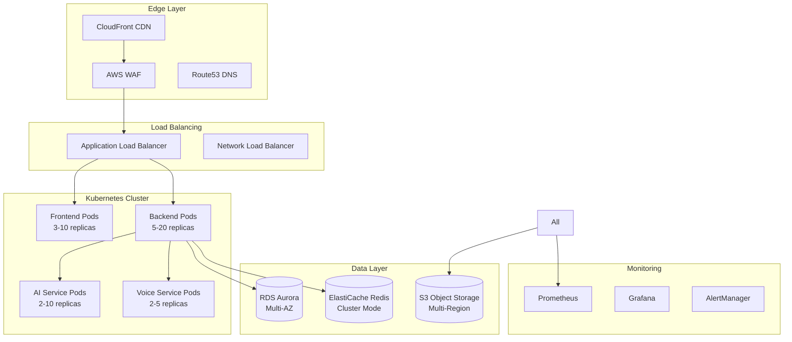

# WhatsOpí Operations Manual

*Comprehensive Operations Guide for Production Environment Management*

---

## 📋 Overview

This Operations Manual provides complete guidance for managing WhatsOpí in production, covering monitoring, maintenance, incident response, and optimization procedures specifically designed for serving the Dominican Republic's informal economy at scale.

### 🎯 Operational Excellence Goals

- **99.9% Uptime**: Maximum 8.77 hours downtime per year
- **Sub-2-Second Response**: Optimized for Caribbean networks
- **24/7 Availability**: Critical services always operational
- **Cultural Compliance**: Maintaining Dominican and Haitian cultural standards
- **Regulatory Adherence**: Dominican Law 172-13 and PCI DSS compliance

---

## 🏗️ System Architecture Overview

### Production Environment



### Service Dependencies

| Service | Critical Dependencies | Graceful Degradation |
|---------|----------------------|---------------------|
| **Frontend** | CDN, ALB | Offline mode via PWA |
| **Backend API** | RDS, Redis, S3 | Read-only mode |
| **AI Services** | Claude API, Custom Models | Basic text processing |
| **Voice Processing** | Web Speech API, S3 | Text-only interface |
| **Payment System** | External APIs, RDS | Queue transactions |
| **WhatsApp Integration** | WhatsApp Business API | SMS fallback |

---

## 📊 Monitoring and Alerting

### Key Performance Indicators (KPIs)

#### System Health Metrics
```yaml
api_response_time:
  p50: <100ms
  p95: <500ms  
  p99: <1000ms
  target_sla: 99.9%

database_performance:
  connection_utilization: <80%
  query_response_time: <50ms
  connection_pool_size: 100-500

redis_cache:
  hit_ratio: >90%
  memory_utilization: <75%
  connection_count: <1000

kubernetes_cluster:
  cpu_utilization: <70%
  memory_utilization: <80%
  pod_restart_rate: <5/day
```

#### Business Metrics
```yaml
dominican_users:
  active_daily_users: >10000
  registration_rate: >500/day
  voice_command_success: >95%

transactions:
  success_rate: >99%
  dominican_peso_volume: >RD$1M/day
  average_transaction_time: <30s

cultural_performance:
  spanish_recognition_accuracy: >95%
  creole_processing_accuracy: >90%
  cultural_appropriateness_score: >95%
```

### Monitoring Stack Configuration

#### Prometheus Metrics Collection
```yaml
# prometheus.yml
global:
  scrape_interval: 15s
  evaluation_interval: 15s

rule_files:
  - "whatsopi-alerts.yml"
  - "dominican-business-rules.yml"

scrape_configs:
  - job_name: 'whatsopi-api'
    kubernetes_sd_configs:
      - role: pod
        namespaces:
          names:
            - production
    relabel_configs:
      - source_labels: [__meta_kubernetes_pod_label_app]
        action: keep
        regex: whatsopi-.*

  - job_name: 'dominican-voice-service'
    static_configs:
      - targets: ['voice-service:8080']
    scrape_interval: 10s
    metrics_path: /metrics/voice

  - job_name: 'cultural-analytics'
    static_configs:
      - targets: ['cultural-service:8080']
    scrape_interval: 30s
```

#### Grafana Dashboards

**Main Operations Dashboard:**
```json
{
  "dashboard": {
    "title": "WhatsOpí Operations - Dominican Republic",
    "panels": [
      {
        "title": "API Response Times (Dominican Networks)",
        "type": "graph",
        "targets": [
          {
            "expr": "histogram_quantile(0.95, rate(http_request_duration_seconds_bucket{job=\"whatsopi-api\"}[5m]))",
            "legendFormat": "95th percentile"
          }
        ]
      },
      {
        "title": "Dominican User Activity",
        "type": "stat",
        "targets": [
          {
            "expr": "sum(rate(user_registrations_total{country=\"DO\"}[1h]))",
            "legendFormat": "Registrations/hour"
          }
        ]
      },
      {
        "title": "Voice Recognition Accuracy (Spanish/Creole)",
        "type": "gauge",
        "targets": [
          {
            "expr": "avg(voice_recognition_accuracy{language=\"es-DO\"})",
            "legendFormat": "Dominican Spanish"
          },
          {
            "expr": "avg(voice_recognition_accuracy{language=\"ht\"})",
            "legendFormat": "Haitian Creole"
          }
        ]
      }
    ]
  }
}
```

### Alert Configuration

#### Critical Alerts
```yaml
# whatsopi-alerts.yml
groups:
  - name: whatsopi-critical
    rules:
      - alert: APIHighLatency
        expr: histogram_quantile(0.95, rate(http_request_duration_seconds_bucket[5m])) > 2
        for: 2m
        labels:
          severity: critical
          team: sre
        annotations:
          summary: "API response time too high for Dominican users"
          description: "95th percentile latency is {{ $value }}s, affecting Caribbean network users"

      - alert: DominicanUserRegistrationDrop
        expr: rate(user_registrations_total{country="DO"}[1h]) < 10
        for: 5m
        labels:
          severity: warning
          team: growth
        annotations:
          summary: "Dominican user registrations below threshold"
          description: "Only {{ $value }} registrations in the last hour"

      - alert: VoiceRecognitionAccuracyLow
        expr: avg(voice_recognition_accuracy{language="es-DO"}) < 0.90
        for: 3m
        labels:
          severity: critical
          team: ai
        annotations:
          summary: "Dominican Spanish voice recognition accuracy degraded"
          description: "Accuracy dropped to {{ $value }}%, affecting low-literacy users"

      - alert: PaymentProcessingFailure
        expr: rate(payment_failures_total[5m]) > 0.01
        for: 1m
        labels:
          severity: critical
          team: payments
        annotations:
          summary: "Payment processing failure rate too high"
          description: "{{ $value }} payment failures per second"
```

#### Business Alerts
```yaml
  - name: whatsopi-business
    rules:
      - alert: ColmadoOrderVolumeLow
        expr: sum(rate(colmado_orders_total[1h])) < 100
        for: 10m
        labels:
          severity: warning
          team: business
        annotations:
          summary: "Colmado order volume below expected"
          description: "Only {{ $value }} orders in the last hour"

      - alert: CulturalAppropriatenessIssue
        expr: cultural_appropriateness_score < 0.90
        for: 5m
        labels:
          severity: warning
          team: cultural
        annotations:
          summary: "Cultural appropriateness score degraded"
          description: "Score is {{ $value }}, may affect user experience"
```

---

## 🔧 Daily Operations

### Morning Checklist (8:00 AM AST)

```bash
#!/bin/bash
# daily-morning-check.sh

echo "WhatsOpí Daily Morning Health Check - $(date)"
echo "============================================"

# 1. Check overall system health
echo "🏥 System Health Check..."
curl -f https://api.whatsopi.do/health || echo "❌ API Health Check Failed"
curl -f https://whatsopi.do/health || echo "❌ Frontend Health Check Failed"

# 2. Verify Dominican-specific services
echo "🇩🇴 Dominican Services Check..."
curl -f https://api.whatsopi.do/api/v1/cultural/dominican/status || echo "❌ Dominican Cultural Service Issue"

# 3. Check database performance
echo "🗄️ Database Performance..."
kubectl exec -n production deployment/whatsopi-api -- npm run db:health-check

# 4. Verify WhatsApp Business API
echo "💬 WhatsApp Integration..."
curl -f https://api.whatsopi.do/api/v1/whatsapp/health || echo "❌ WhatsApp Service Issue"

# 5. Check AI services accuracy
echo "🤖 AI Services Accuracy..."
SPANISH_ACCURACY=$(curl -s https://api.whatsopi.do/metrics | grep voice_accuracy_spanish | awk '{print $2}')
echo "Spanish Voice Accuracy: ${SPANISH_ACCURACY}%"

# 6. Verify payment systems
echo "💰 Payment Systems..."
curl -f https://api.whatsopi.do/api/v1/payments/health || echo "❌ Payment System Issue"

# 7. Check business metrics
echo "📊 Business Metrics (Last 24h)..."
kubectl exec -n production deployment/whatsopi-api -- npm run metrics:daily-summary

echo "✅ Morning check complete"
```

### Hourly Monitoring Tasks

```bash
#!/bin/bash
# hourly-monitoring.sh

# Dominican business hours optimization (6 AM - 10 PM AST)
CURRENT_HOUR=$(date +%H)
TIMEZONE="America/Santo_Domingo"

if [ $CURRENT_HOUR -ge 6 ] && [ $CURRENT_HOUR -le 22 ]; then
    echo "Peak Dominican business hours - Enhanced monitoring"
    
    # Scale up during peak hours
    kubectl scale deployment whatsopi-api --replicas=15 -n production
    kubectl scale deployment whatsopi-ai --replicas=8 -n production
    
    # Monitor voice service during peak usage
    kubectl logs -f deployment/whatsopi-voice -n production --tail=100 | grep -E "(error|exception)" &
    
    # Check colmado integration status
    curl -s https://api.whatsopi.do/api/v1/colmados/health-summary
    
else
    echo "Off-peak hours - Standard monitoring"
    
    # Scale down during off-peak
    kubectl scale deployment whatsopi-api --replicas=8 -n production
    kubectl scale deployment whatsopi-ai --replicas=3 -n production
fi

# Always check critical services
curl -f https://api.whatsopi.do/health
curl -f https://api.whatsopi.do/api/v1/payments/health
```

### Weekly Maintenance Tasks

```bash
#!/bin/bash
# weekly-maintenance.sh

echo "WhatsOpí Weekly Maintenance - $(date)"
echo "===================================="

# 1. Database maintenance
echo "🗄️ Database maintenance..."
kubectl exec -n production deployment/whatsopi-api -- npm run db:vacuum
kubectl exec -n production deployment/whatsopi-api -- npm run db:analyze
kubectl exec -n production deployment/whatsopi-api -- npm run db:reindex

# 2. Clear old logs and temporary files
echo "🧹 Cleanup tasks..."
kubectl exec -n production deployment/whatsopi-api -- find /tmp -name "voice-*.wav" -mtime +7 -delete
kubectl exec -n production deployment/whatsopi-api -- npm run logs:rotate

# 3. Update cultural data
echo "🌍 Cultural data update..."
kubectl exec -n production deployment/whatsopi-ai -- npm run cultural:update-dominican-expressions
kubectl exec -n production deployment/whatsopi-ai -- npm run cultural:update-creole-dictionary

# 4. Security scans
echo "🔒 Security maintenance..."
trivy image whatsopi/api:latest
npm audit --audit-level=moderate

# 5. Performance optimization
echo "⚡ Performance optimization..."
kubectl exec -n production deployment/whatsopi-api -- npm run cache:optimize
kubectl exec -n production deployment/whatsopi-api -- npm run db:optimize-queries

# 6. Backup verification
echo "💾 Backup verification..."
aws s3 ls s3://whatsopi-backups/$(date +%Y-%m-%d)/ || echo "❌ Backup missing for today"

# 7. Cultural accuracy review
echo "🎭 Cultural accuracy review..."
kubectl exec -n production deployment/whatsopi-ai -- npm run cultural:accuracy-report

echo "✅ Weekly maintenance complete"
```

---

## 🚨 Incident Response

### Incident Classification

#### Severity Levels

**P0 - Critical (Response: 15 minutes)**
- Complete service outage
- Payment processing completely down
- Data breach or security incident
- WhatsApp Business API completely unavailable

**P1 - High (Response: 1 hour)**
- Significant performance degradation (>5s response time)
- Voice recognition accuracy <80% for Dominican Spanish
- Major feature unavailable (registration, payments)
- Database connection issues

**P2 - Medium (Response: 4 hours)**
- Minor performance issues
- Non-critical feature unavailable
- Voice recognition accuracy 80-90%
- Monitoring alerts but service functional

**P3 - Low (Response: 24 hours)**
- Cosmetic issues
- Documentation problems
- Minor cultural appropriateness issues
- Enhancement requests

### Incident Response Procedures

#### P0 Critical Incident Response

```bash
#!/bin/bash
# critical-incident-response.sh

echo "🚨 CRITICAL INCIDENT RESPONSE INITIATED"
echo "Time: $(date)"
echo "======================================="

# 1. Immediate assessment
echo "📊 System Status Assessment..."
kubectl get pods -n production | grep -v Running
kubectl top nodes
kubectl get svc -n production

# 2. Check external dependencies
echo "🔌 External Dependencies..."
curl -I https://api.openai.com/v1/models
curl -I https://api.anthropic.com/v1/messages
curl -I https://graph.facebook.com/v18.0/

# 3. Database health
echo "🗄️ Database Status..."
kubectl exec -n production deployment/whatsopi-api -- psql $DATABASE_URL -c "SELECT 1;" || echo "❌ Database Connection Failed"

# 4. Scale up for resilience
echo "📈 Emergency Scaling..."
kubectl scale deployment whatsopi-api --replicas=20 -n production
kubectl scale deployment whatsopi-frontend --replicas=10 -n production

# 5. Enable emergency mode
echo "🆘 Activating Emergency Mode..."
kubectl patch configmap whatsopi-config -n production -p '{"data":{"emergency_mode":"true"}}'
kubectl rollout restart deployment/whatsopi-api -n production

# 6. Notify stakeholders
echo "📢 Stakeholder Notification..."
curl -X POST $SLACK_WEBHOOK_URL -d '{
  "text": "🚨 CRITICAL INCIDENT: WhatsOpí Production Issue",
  "attachments": [
    {
      "color": "danger",
      "fields": [
        {"title": "Status", "value": "CRITICAL", "short": true},
        {"title": "Time", "value": "'$(date)'", "short": true},
        {"title": "Impact", "value": "Dominican users affected", "short": false}
      ]
    }
  ]
}'

# 7. Create incident record
INCIDENT_ID="INC-$(date +%Y%m%d-%H%M%S)"
echo "📝 Incident ID: $INCIDENT_ID"

# 8. Collect diagnostics
echo "🔍 Collecting Diagnostics..."
kubectl logs -n production deployment/whatsopi-api --tail=1000 > "/tmp/incident-${INCIDENT_ID}-api.log"
kubectl describe pods -n production > "/tmp/incident-${INCIDENT_ID}-pods.log"
```

#### Common Incident Scenarios

**Scenario 1: Dominican Voice Recognition Degraded**
```bash
# voice-recognition-incident.sh

echo "🎤 Voice Recognition Incident Response"

# Check AI service health
kubectl logs -n production deployment/whatsopi-ai --tail=500 | grep -E "(error|exception)"

# Verify AI model endpoints
curl -f https://api.anthropic.com/v1/messages/health
curl -f https://api.openai.com/v1/models

# Test Dominican Spanish recognition
curl -X POST https://api.whatsopi.do/api/v1/ai/voice/test \
  -H "Content-Type: application/json" \
  -d '{"text": "Klk tiguer, busco arroz en el colmado", "language": "es-DO"}'

# Restart AI services if needed
kubectl rollout restart deployment/whatsopi-ai -n production

# Fallback to basic text processing
kubectl patch configmap whatsopi-config -n production -p '{"data":{"voice_fallback_mode":"true"}}'
```

**Scenario 2: Payment Processing Issues**
```bash
# payment-incident.sh

echo "💰 Payment Processing Incident Response"

# Check payment provider status
curl -f https://api.tpago.com/health
curl -f https://api.paypal.com/v1/oauth2/token
curl -f https://api.stripe.com/v1/account

# Verify database connections
kubectl exec -n production deployment/whatsopi-api -- npm run db:payment-tables-check

# Enable payment queue mode
kubectl patch configmap whatsopi-config -n production -p '{"data":{"payment_queue_mode":"true"}}'

# Notify payment team
curl -X POST $PAYMENT_TEAM_WEBHOOK -d '{
  "text": "Payment processing incident detected",
  "channel": "#payments-alerts"
}'
```

### Post-Incident Review

#### Incident Report Template

```markdown
# Incident Report: [INCIDENT_ID]

## Summary
- **Date**: YYYY-MM-DD
- **Duration**: X hours Y minutes
- **Severity**: PX
- **Impact**: Dominican users / Haitian users / All users
- **Services Affected**: [List of services]

## Timeline (AST - America/Santo_Domingo)
- **HH:MM** - Incident detected
- **HH:MM** - Response team notified
- **HH:MM** - Initial mitigation applied
- **HH:MM** - Service restored
- **HH:MM** - Full resolution confirmed

## Root Cause
[Detailed technical explanation]

## Impact Assessment
- **Users Affected**: X Dominican users, Y Haitian users
- **Transactions Lost**: Z payments (RD$Amount)
- **Voice Recognition**: Accuracy dropped from X% to Y%
- **Business Impact**: [Revenue/reputation impact]

## Resolution
[What was done to fix the issue]

## Prevention Measures
1. [Action item 1]
2. [Action item 2]
3. [Action item 3]

## Cultural Considerations
- [Any cultural sensitivity issues]
- [Impact on Dominican Spanish processing]
- [Effect on Haitian Creole users]

## Lessons Learned
[Key takeaways for future prevention]
```

---

## 🔄 Deployment Operations

### Blue-Green Deployment Process

```bash
#!/bin/bash
# blue-green-deployment.sh

DEPLOYMENT_VERSION=$1
ENVIRONMENT=${2:-production}

echo "🔄 Starting Blue-Green Deployment"
echo "Version: $DEPLOYMENT_VERSION"
echo "Environment: $ENVIRONMENT"
echo "================================"

# 1. Verify current green environment
echo "✅ Checking current environment..."
CURRENT_COLOR=$(kubectl get service whatsopi-api -n $ENVIRONMENT -o jsonpath='{.spec.selector.color}')
NEW_COLOR=$([ "$CURRENT_COLOR" = "blue" ] && echo "green" || echo "blue")

echo "Current: $CURRENT_COLOR"
echo "Deploying to: $NEW_COLOR"

# 2. Deploy to inactive environment
echo "🚀 Deploying to $NEW_COLOR environment..."
kubectl set image deployment/whatsopi-api-$NEW_COLOR \
  whatsopi-api=whatsopi/api:$DEPLOYMENT_VERSION \
  -n $ENVIRONMENT

kubectl set image deployment/whatsopi-frontend-$NEW_COLOR \
  whatsopi-frontend=whatsopi/frontend:$DEPLOYMENT_VERSION \
  -n $ENVIRONMENT

# 3. Wait for deployment to be ready
echo "⏳ Waiting for $NEW_COLOR deployment..."
kubectl rollout status deployment/whatsopi-api-$NEW_COLOR -n $ENVIRONMENT
kubectl rollout status deployment/whatsopi-frontend-$NEW_COLOR -n $ENVIRONMENT

# 4. Run health checks on new environment
echo "🏥 Running health checks on $NEW_COLOR..."
sleep 30  # Allow services to fully start

NEW_API_ENDPOINT="http://whatsopi-api-$NEW_COLOR.$ENVIRONMENT.svc.cluster.local"
curl -f $NEW_API_ENDPOINT/health || {
    echo "❌ Health check failed on $NEW_COLOR"
    exit 1
}

# 5. Test Dominican-specific functionality
echo "🇩🇴 Testing Dominican functionality..."
curl -f $NEW_API_ENDPOINT/api/v1/cultural/dominican/health || {
    echo "❌ Dominican cultural service failed"
    exit 1
}

# 6. Test voice recognition
echo "🎤 Testing voice recognition..."
curl -X POST $NEW_API_ENDPOINT/api/v1/ai/voice/test \
  -H "Content-Type: application/json" \
  -d '{"text": "Klk, busco pollo en colmados", "language": "es-DO"}' || {
    echo "❌ Voice recognition test failed"
    exit 1
}

# 7. Switch traffic to new environment
echo "🔀 Switching traffic to $NEW_COLOR..."
kubectl patch service whatsopi-api -n $ENVIRONMENT -p "{\"spec\":{\"selector\":{\"color\":\"$NEW_COLOR\"}}}"
kubectl patch service whatsopi-frontend -n $ENVIRONMENT -p "{\"spec\":{\"selector\":{\"color\":\"$NEW_COLOR\"}}}"

# 8. Monitor new environment
echo "📊 Monitoring $NEW_COLOR environment for 5 minutes..."
for i in {1..10}; do
    echo "Check $i/10..."
    curl -f https://api.whatsopi.do/health || {
        echo "❌ Production health check failed, rolling back..."
        kubectl patch service whatsopi-api -n $ENVIRONMENT -p "{\"spec\":{\"selector\":{\"color\":\"$CURRENT_COLOR\"}}}"
        kubectl patch service whatsopi-frontend -n $ENVIRONMENT -p "{\"spec\":{\"selector\":{\"color\":\"$CURRENT_COLOR\"}}}"
        exit 1
    }
    sleep 30
done

# 9. Scale down old environment
echo "📉 Scaling down $CURRENT_COLOR environment..."
kubectl scale deployment whatsopi-api-$CURRENT_COLOR --replicas=0 -n $ENVIRONMENT
kubectl scale deployment whatsopi-frontend-$CURRENT_COLOR --replicas=0 -n $ENVIRONMENT

echo "✅ Blue-Green deployment completed successfully!"
echo "Active environment: $NEW_COLOR"
```

### Rollback Procedures

```bash
#!/bin/bash
# emergency-rollback.sh

ENVIRONMENT=${1:-production}

echo "🚨 EMERGENCY ROLLBACK INITIATED"
echo "Environment: $ENVIRONMENT"
echo "==============================="

# 1. Identify current and previous colors
CURRENT_COLOR=$(kubectl get service whatsopi-api -n $ENVIRONMENT -o jsonpath='{.spec.selector.color}')
PREVIOUS_COLOR=$([ "$CURRENT_COLOR" = "blue" ] && echo "green" || echo "blue")

echo "Rolling back from $CURRENT_COLOR to $PREVIOUS_COLOR"

# 2. Scale up previous environment immediately
echo "📈 Scaling up $PREVIOUS_COLOR environment..."
kubectl scale deployment whatsopi-api-$PREVIOUS_COLOR --replicas=10 -n $ENVIRONMENT
kubectl scale deployment whatsopi-frontend-$PREVIOUS_COLOR --replicas=5 -n $ENVIRONMENT

# 3. Wait for previous environment to be ready
echo "⏳ Waiting for $PREVIOUS_COLOR to be ready..."
kubectl rollout status deployment/whatsopi-api-$PREVIOUS_COLOR -n $ENVIRONMENT --timeout=60s

# 4. Switch traffic back
echo "🔀 Switching traffic back to $PREVIOUS_COLOR..."
kubectl patch service whatsopi-api -n $ENVIRONMENT -p "{\"spec\":{\"selector\":{\"color\":\"$PREVIOUS_COLOR\"}}}"
kubectl patch service whatsopi-frontend -n $ENVIRONMENT -p "{\"spec\":{\"selector\":{\"color\":\"$PREVIOUS_COLOR\"}}}"

# 5. Verify rollback success
echo "✅ Verifying rollback..."
curl -f https://api.whatsopi.do/health || {
    echo "❌ Rollback verification failed!"
    exit 1
}

# 6. Notify team
curl -X POST $SLACK_WEBHOOK_URL -d '{
  "text": "🚨 Emergency rollback completed",
  "attachments": [
    {
      "color": "warning",
      "fields": [
        {"title": "Environment", "value": "'$ENVIRONMENT'", "short": true},
        {"title": "Active Color", "value": "'$PREVIOUS_COLOR'", "short": true},
        {"title": "Time", "value": "'$(date)'", "short": false}
      ]
    }
  ]
}'

echo "✅ Emergency rollback completed successfully!"
```

---

## 💾 Backup and Recovery

### Backup Strategy

#### Database Backups
```bash
#!/bin/bash
# database-backup.sh

TIMESTAMP=$(date +%Y%m%d_%H%M%S)
BACKUP_BUCKET="whatsopi-backups"
DB_NAME="whatsopi_production"

echo "💾 Starting database backup: $TIMESTAMP"

# 1. Create encrypted database dump
echo "📊 Creating database dump..."
kubectl exec -n production deployment/whatsopi-api -- pg_dump \
  $DATABASE_URL \
  --no-owner \
  --no-privileges \
  --format=custom \
  --compress=9 > "/tmp/whatsopi_db_${TIMESTAMP}.dump"

# 2. Encrypt backup
echo "🔒 Encrypting backup..."
gpg --symmetric --cipher-algo AES256 --compress-algo 1 --s2k-mode 3 \
  --s2k-digest-algo SHA512 --s2k-count 65536 \
  --output "/tmp/whatsopi_db_${TIMESTAMP}.dump.gpg" \
  "/tmp/whatsopi_db_${TIMESTAMP}.dump"

# 3. Upload to S3 with lifecycle policy
echo "☁️ Uploading to S3..."
aws s3 cp "/tmp/whatsopi_db_${TIMESTAMP}.dump.gpg" \
  "s3://${BACKUP_BUCKET}/database/$(date +%Y/%m/%d)/whatsopi_db_${TIMESTAMP}.dump.gpg" \
  --storage-class STANDARD_IA

# 4. Create backup metadata
echo "📝 Creating backup metadata..."
cat > "/tmp/backup_${TIMESTAMP}.json" << EOF
{
  "timestamp": "$TIMESTAMP",
  "database": "$DB_NAME",
  "size_bytes": $(stat -c%s "/tmp/whatsopi_db_${TIMESTAMP}.dump"),
  "encrypted": true,
  "location": "s3://${BACKUP_BUCKET}/database/$(date +%Y/%m/%d)/",
  "retention_days": 30,
  "dominican_users_count": $(kubectl exec -n production deployment/whatsopi-api -- psql $DATABASE_URL -t -c "SELECT COUNT(*) FROM users WHERE country='DO';"),
  "haitian_users_count": $(kubectl exec -n production deployment/whatsopi-api -- psql $DATABASE_URL -t -c "SELECT COUNT(*) FROM users WHERE country='HT';")
}
EOF

aws s3 cp "/tmp/backup_${TIMESTAMP}.json" \
  "s3://${BACKUP_BUCKET}/metadata/backup_${TIMESTAMP}.json"

# 5. Cleanup local files
rm "/tmp/whatsopi_db_${TIMESTAMP}.dump"
rm "/tmp/whatsopi_db_${TIMESTAMP}.dump.gpg"
rm "/tmp/backup_${TIMESTAMP}.json"

# 6. Verify backup integrity
echo "✅ Verifying backup integrity..."
aws s3 ls "s3://${BACKUP_BUCKET}/database/$(date +%Y/%m/%d)/whatsopi_db_${TIMESTAMP}.dump.gpg" || {
    echo "❌ Backup verification failed!"
    exit 1
}

echo "✅ Database backup completed: $TIMESTAMP"
```

#### Voice Data Backup
```bash
#!/bin/bash
# voice-data-backup.sh

TIMESTAMP=$(date +%Y%m%d_%H%M%S)

echo "🎤 Starting voice data backup: $TIMESTAMP"

# 1. Backup voice recordings (anonymized)
echo "📼 Backing up voice recordings..."
kubectl exec -n production deployment/whatsopi-voice -- tar -czf \
  "/tmp/voice_data_${TIMESTAMP}.tar.gz" \
  /app/voice-data/anonymized/

# 2. Backup voice model data
echo "🤖 Backing up voice models..."
kubectl exec -n production deployment/whatsopi-ai -- tar -czf \
  "/tmp/voice_models_${TIMESTAMP}.tar.gz" \
  /app/models/voice/dominican/ \
  /app/models/voice/creole/

# 3. Upload to S3
aws s3 cp "/tmp/voice_data_${TIMESTAMP}.tar.gz" \
  "s3://whatsopi-backups/voice-data/$(date +%Y/%m/%d)/"

aws s3 cp "/tmp/voice_models_${TIMESTAMP}.tar.gz" \
  "s3://whatsopi-backups/voice-models/$(date +%Y/%m/%d)/"

echo "✅ Voice data backup completed"
```

### Recovery Procedures

#### Database Recovery
```bash
#!/bin/bash
# database-recovery.sh

BACKUP_FILE=$1
RECOVERY_DB=${2:-whatsopi_recovery}

echo "🔄 Starting database recovery"
echo "Backup file: $BACKUP_FILE"
echo "Target database: $RECOVERY_DB"

# 1. Download backup from S3
echo "⬇️ Downloading backup..."
aws s3 cp "$BACKUP_FILE" "/tmp/recovery_backup.dump.gpg"

# 2. Decrypt backup
echo "🔓 Decrypting backup..."
gpg --decrypt "/tmp/recovery_backup.dump.gpg" > "/tmp/recovery_backup.dump"

# 3. Create recovery database
echo "🗄️ Creating recovery database..."
kubectl exec -n production deployment/whatsopi-api -- createdb $RECOVERY_DB

# 4. Restore data
echo "📥 Restoring data..."
kubectl exec -n production deployment/whatsopi-api -- pg_restore \
  --dbname=$RECOVERY_DB \
  --verbose \
  --no-owner \
  --no-privileges \
  "/tmp/recovery_backup.dump"

# 5. Verify data integrity
echo "✅ Verifying data integrity..."
ORIGINAL_USER_COUNT=$(kubectl exec -n production deployment/whatsopi-api -- psql $RECOVERY_DB -t -c "SELECT COUNT(*) FROM users;")
echo "Restored users: $ORIGINAL_USER_COUNT"

# 6. Update connection strings for testing
echo "🔗 Recovery database ready for testing"
echo "Connection: $RECOVERY_DB"

# Cleanup
rm "/tmp/recovery_backup.dump.gpg"
rm "/tmp/recovery_backup.dump"

echo "✅ Database recovery completed"
```

#### Point-in-Time Recovery
```bash
#!/bin/bash
# point-in-time-recovery.sh

TARGET_TIME=$1  # Format: 2024-12-01 14:30:00
RECOVERY_IDENTIFIER="whatsopi-pitr-$(date +%s)"

echo "⏰ Starting point-in-time recovery to: $TARGET_TIME"

# 1. Create RDS point-in-time recovery
echo "☁️ Creating RDS point-in-time recovery..."
aws rds restore-db-cluster-to-point-in-time \
  --db-cluster-identifier "$RECOVERY_IDENTIFIER" \
  --source-db-cluster-identifier "whatsopi-production" \
  --restore-to-time "$TARGET_TIME" \
  --db-subnet-group-name "whatsopi-db-subnet-group" \
  --vpc-security-group-ids "sg-whatsopi-db"

# 2. Wait for cluster to be available
echo "⏳ Waiting for recovery cluster..."
aws rds wait db-cluster-available --db-cluster-identifier "$RECOVERY_IDENTIFIER"

# 3. Get recovery endpoint
RECOVERY_ENDPOINT=$(aws rds describe-db-clusters \
  --db-cluster-identifier "$RECOVERY_IDENTIFIER" \
  --query 'DBClusters[0].Endpoint' --output text)

echo "✅ Point-in-time recovery completed"
echo "Recovery endpoint: $RECOVERY_ENDPOINT"
echo "Time: $TARGET_TIME"
```

---

## 🔍 Performance Optimization

### Database Optimization

#### Query Performance Monitoring
```sql
-- Monitor slow queries affecting Dominican users
SELECT 
  query,
  calls,
  total_time,
  mean_time,
  rows,
  100.0 * shared_blks_hit / nullif(shared_blks_hit + shared_blks_read, 0) AS hit_percent
FROM pg_stat_statements 
WHERE query ILIKE '%dominican%' OR query ILIKE '%spanish%' OR query ILIKE '%creole%'
ORDER BY total_time DESC
LIMIT 10;

-- Index usage for Dominican-specific queries
SELECT 
  schemaname,
  tablename,
  attname,
  n_distinct,
  correlation
FROM pg_stats 
WHERE tablename IN ('users', 'transactions', 'voice_recordings')
  AND attname IN ('country', 'language', 'phone_number')
ORDER BY n_distinct DESC;
```

#### Database Maintenance
```bash
#!/bin/bash
# database-maintenance.sh

echo "🗄️ Starting database maintenance"

# 1. Update table statistics
echo "📊 Updating statistics..."
kubectl exec -n production deployment/whatsopi-api -- psql $DATABASE_URL -c "
  ANALYZE users;
  ANALYZE transactions; 
  ANALYZE voice_recordings;
  ANALYZE colmados;
"

# 2. Reindex frequently used tables
echo "🔄 Reindexing tables..."
kubectl exec -n production deployment/whatsopi-api -- psql $DATABASE_URL -c "
  REINDEX INDEX CONCURRENTLY idx_users_phone_country;
  REINDEX INDEX CONCURRENTLY idx_transactions_user_date;
  REINDEX INDEX CONCURRENTLY idx_voice_language_accuracy;
"

# 3. Check for unused indexes
echo "🔍 Checking unused indexes..."
kubectl exec -n production deployment/whatsopi-api -- psql $DATABASE_URL -c "
  SELECT 
    indexrelname as index_name,
    relname as table_name,
    idx_scan as times_used
  FROM pg_stat_user_indexes 
  WHERE idx_scan < 10 
    AND schemaname = 'public'
  ORDER BY idx_scan;
"

# 4. Vacuum frequently updated tables
echo "🧹 Running vacuum..."
kubectl exec -n production deployment/whatsopi-api -- psql $DATABASE_URL -c "
  VACUUM ANALYZE users;
  VACUUM ANALYZE transactions;
  VACUUM ANALYZE sessions;
"

echo "✅ Database maintenance completed"
```

### Application Performance

#### Cache Optimization
```bash
#!/bin/bash
# cache-optimization.sh

echo "🚀 Cache optimization for Dominican users"

# 1. Warm up Dominican-specific caches
echo "🔥 Warming up caches..."
curl -X POST https://api.whatsopi.do/admin/cache/warm \
  -H "Authorization: Bearer $ADMIN_TOKEN" \
  -d '{
    "regions": ["DO", "HT"],
    "languages": ["es-DO", "ht"],
    "data_types": ["cultural_expressions", "phone_formats", "currency_rates"]
  }'

# 2. Check cache hit rates
echo "📊 Cache performance metrics..."
REDIS_HITS=$(kubectl exec -n production deployment/redis -- redis-cli info stats | grep keyspace_hits | cut -d: -f2)
REDIS_MISSES=$(kubectl exec -n production deployment/redis -- redis-cli info stats | grep keyspace_misses | cut -d: -f2)
HIT_RATE=$(echo "scale=2; $REDIS_HITS / ($REDIS_HITS + $REDIS_MISSES) * 100" | bc)

echo "Cache hit rate: $HIT_RATE%"

# 3. Optimize cache expiration for Dominican patterns
kubectl exec -n production deployment/whatsopi-api -- node -e "
  const redis = require('redis').createClient(process.env.REDIS_URL);
  
  // Set longer TTL for stable Dominican data
  redis.expire('dominican:phone_prefixes', 86400); // 24 hours
  redis.expire('dominican:cultural_expressions', 43200); // 12 hours
  redis.expire('exchange_rates:DOP', 3600); // 1 hour
  
  console.log('Cache TTL optimized for Dominican patterns');
"

echo "✅ Cache optimization completed"
```

#### CDN Optimization
```bash
#!/bin/bash
# cdn-optimization.sh

echo "🌐 CDN optimization for Caribbean users"

# 1. Purge and warm CDN for Dominican endpoints
echo "🔄 CDN cache management..."
aws cloudfront create-invalidation \
  --distribution-id E1234567890ABC \
  --paths "/api/v1/cultural/dominican/*" "/static/images/dominican/*"

# 2. Configure edge locations for Caribbean
echo "📍 Optimizing edge locations..."
curl -X POST https://api.cloudflare.com/client/v4/zones/$ZONE_ID/settings/polish \
  -H "X-Auth-Email: $CF_EMAIL" \
  -H "X-Auth-Key: $CF_API_KEY" \
  -d '{"value":"lossless"}'

# 3. Enable Caribbean-specific caching rules
echo "⚡ Setting Caribbean caching rules..."
aws cloudfront put-cache-policy \
  --id 1234567890 \
  --cache-policy '{
    "Name": "DominicanOptimized",
    "DefaultTTL": 86400,
    "MaxTTL": 31536000,
    "ParametersInCacheKeyAndForwardedToOrigin": {
      "EnableAcceptEncodingGzip": true,
      "EnableAcceptEncodingBrotli": true,
      "QueryStringsConfig": {
        "QueryStringBehavior": "whitelist",
        "QueryStrings": {
          "Items": ["lang", "country", "currency"]
        }
      },
      "HeadersConfig": {
        "HeaderBehavior": "whitelist",
        "Headers": {
          "Items": ["Accept-Language", "CloudFront-Viewer-Country"]
        }
      }
    }
  }'

echo "✅ CDN optimization completed"
```

---

## 📋 Compliance and Audit

### Dominican Law 172-13 Compliance Monitoring

```bash
#!/bin/bash
# compliance-audit.sh

echo "⚖️ Dominican Law 172-13 Compliance Audit"
echo "========================================"

# 1. Data processing audit
echo "📊 Data processing activities..."
kubectl exec -n production deployment/whatsopi-api -- npm run compliance:audit-data-processing > /tmp/data-processing-audit.json

# 2. User consent verification
echo "✅ User consent verification..."
USERS_WITHOUT_CONSENT=$(kubectl exec -n production deployment/whatsopi-api -- psql $DATABASE_URL -t -c "
  SELECT COUNT(*) FROM users 
  WHERE consent_given IS NULL OR consent_given = FALSE;
")
echo "Users without valid consent: $USERS_WITHOUT_CONSENT"

# 3. Data retention compliance
echo "📅 Data retention compliance..."
kubectl exec -n production deployment/whatsopi-api -- psql $DATABASE_URL -c "
  SELECT 
    table_name,
    COUNT(*) as records,
    MIN(created_at) as oldest_record,
    MAX(created_at) as newest_record
  FROM (
    SELECT 'users' as table_name, created_at FROM users
    UNION ALL
    SELECT 'transactions' as table_name, created_at FROM transactions
    UNION ALL
    SELECT 'voice_recordings' as table_name, created_at FROM voice_recordings
  ) combined
  GROUP BY table_name;
"

# 4. Cross-border transfer monitoring
echo "🌍 Cross-border data transfers..."
HAITI_TRANSFERS=$(kubectl exec -n production deployment/whatsopi-api -- psql $DATABASE_URL -t -c "
  SELECT COUNT(*) FROM transactions 
  WHERE recipient_country = 'HT' 
    AND created_at > NOW() - INTERVAL '24 hours';
")
echo "Transfers to Haiti (24h): $HAITI_TRANSFERS"

# 5. Privacy rights requests
echo "🔒 Privacy rights requests..."
kubectl exec -n production deployment/whatsopi-api -- psql $DATABASE_URL -c "
  SELECT 
    request_type,
    status,
    COUNT(*),
    AVG(EXTRACT(EPOCH FROM (resolved_at - created_at))/3600) as avg_hours_to_resolve
  FROM privacy_requests 
  WHERE created_at > NOW() - INTERVAL '30 days'
  GROUP BY request_type, status;
"

echo "✅ Compliance audit completed"
```

### PCI DSS Compliance Verification

```bash
#!/bin/bash
# pci-compliance-check.sh

echo "💳 PCI DSS Compliance Verification"
echo "================================="

# 1. Network segmentation check
echo "🔒 Network segmentation..."
kubectl exec -n production deployment/whatsopi-api -- netstat -an | grep :3000
kubectl get networkpolicies -n production

# 2. Encryption verification
echo "🔐 Encryption verification..."
kubectl exec -n production deployment/whatsopi-api -- node -e "
  const crypto = require('crypto');
  const testData = 'test-card-data';
  const key = process.env.ENCRYPTION_KEY;
  
  const cipher = crypto.createCipher('aes-256-gcm', key);
  let encrypted = cipher.update(testData, 'utf8', 'hex');
  encrypted += cipher.final('hex');
  
  console.log('Encryption test: PASSED');
"

# 3. Access control audit
echo "👥 Access control audit..."
kubectl get rolebindings -n production
kubectl auth can-i --list --as=system:serviceaccount:production:whatsopi-api

# 4. Payment data scanning
echo "💰 Payment data scanning..."
kubectl exec -n production deployment/whatsopi-api -- grep -r "4[0-9]{12}(?:[0-9]{3})?" /app/logs/ || echo "No credit card data found in logs"

# 5. Vulnerability assessment
echo "🔍 Vulnerability assessment..."
trivy image whatsopi/api:latest --severity HIGH,CRITICAL

echo "✅ PCI DSS compliance check completed"
```

---

## 📞 Operations Support

### Contact Information

#### Operations Team Structure

**Site Reliability Engineering (SRE)**
- **SRE Lead**: sre-lead@whatsopi.do
- **On-Call Engineer**: +1-809-555-0199 (24/7)
- **Escalation Manager**: escalation@whatsopi.do

**Cultural Operations**
- **Dominican Culture Lead**: cultural-do@whatsopi.do  
- **Haitian Community Lead**: cultural-ht@whatsopi.do
- **Language Processing**: nlp-ops@whatsopi.do

**Business Operations**
- **Colmado Network**: colmados-ops@whatsopi.do
- **Payment Operations**: payments-ops@whatsopi.do
- **Customer Success**: success@whatsopi.do

#### Escalation Matrix

| Severity | Initial Response | Escalation Time | Escalation Path |
|----------|------------------|----------------|-----------------|
| **P0** | On-Call Engineer | 15 minutes | SRE Lead → CTO → CEO |
| **P1** | On-Call Engineer | 1 hour | SRE Lead → Engineering Manager |
| **P2** | Operations Team | 4 hours | Team Lead → SRE Lead |
| **P3** | Business Day | 24 hours | Team Lead |

### Runbook Repository

#### Emergency Procedures
- [Database Emergency Recovery](runbooks/database-emergency.md)
- [Payment System Outage](runbooks/payment-outage.md)
- [Voice Recognition Failure](runbooks/voice-failure.md)
- [WhatsApp API Issues](runbooks/whatsapp-issues.md)
- [Security Incident Response](runbooks/security-incident.md)

#### Maintenance Procedures
- [Database Maintenance Window](runbooks/db-maintenance.md)
- [Application Deployment](runbooks/deployment.md)
- [Cache Warming](runbooks/cache-warming.md)
- [Cultural Data Updates](runbooks/cultural-updates.md)

#### Monitoring and Troubleshooting
- [Performance Troubleshooting](runbooks/performance-debug.md)
- [Log Analysis Guide](runbooks/log-analysis.md)
- [Dominican Network Issues](runbooks/network-caribbean.md)
- [Voice Accuracy Debugging](runbooks/voice-debug.md)

---

## 📊 Operations Dashboard

### Key Metrics Dashboard URLs

- **Main Operations**: https://grafana.whatsopi.do/d/operations-main
- **Dominican Metrics**: https://grafana.whatsopi.do/d/dominican-users
- **Voice Performance**: https://grafana.whatsopi.do/d/voice-accuracy
- **Payment Systems**: https://grafana.whatsopi.do/d/payments
- **Cultural Analytics**: https://grafana.whatsopi.do/d/cultural
- **Compliance Dashboard**: https://grafana.whatsopi.do/d/compliance

### Alert Channels

- **Critical Alerts**: #ops-critical (Slack)
- **Payment Issues**: #payments-alerts (Slack)
- **Cultural Issues**: #cultural-ops (Slack)
- **General Operations**: #ops-general (Slack)
- **SMS Alerts**: +1-809-555-TEAM (For P0 incidents)

---

## 📚 Additional Resources

### Documentation Links

- [Architecture Documentation](../architecture/SYSTEM_ARCHITECTURE.md)
- [API Documentation](../api/README.md)
- [Security Framework](../security/SECURITY_FRAMEWORK.md)
- [Deployment Guide](../production/PRODUCTION_DEPLOYMENT_GUIDE.md)
- [Testing Strategy](../testing/TESTING_STRATEGY.md)

### External Dependencies

- **AWS Console**: https://console.aws.amazon.com
- **Kubernetes Dashboard**: https://k8s.whatsopi.do
- **Anthropic Console**: https://console.anthropic.com
- **WhatsApp Business**: https://business.whatsapp.com
- **Grafana Alerts**: https://grafana.whatsopi.do/alerting

---

**¡Operaciones exitosas para servir a la comunidad dominicana!**

*Operations excellence in service of Dominican digital inclusion* 🇩🇴

---

**Document Information:**
- **Version**: 1.0.0
- **Last Updated**: December 2024
- **Language**: English
- **Review Schedule**: Monthly
- **Emergency Contact**: ops-emergency@whatsopi.do